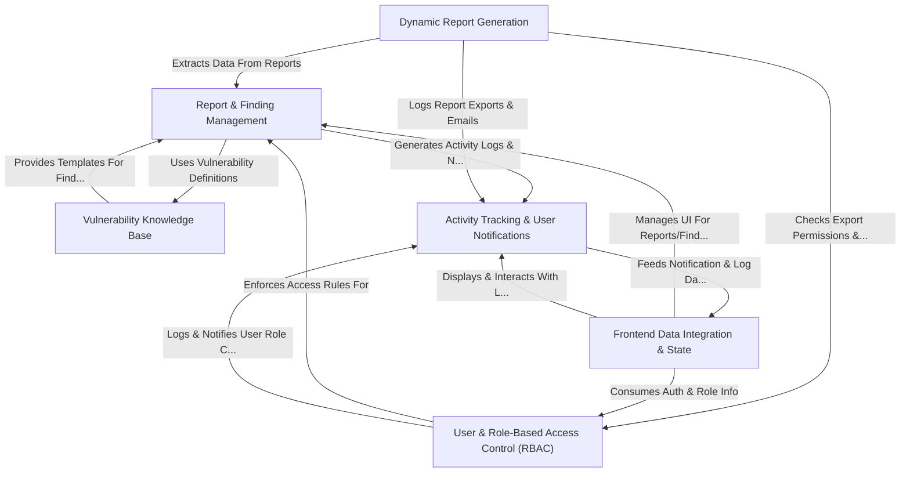
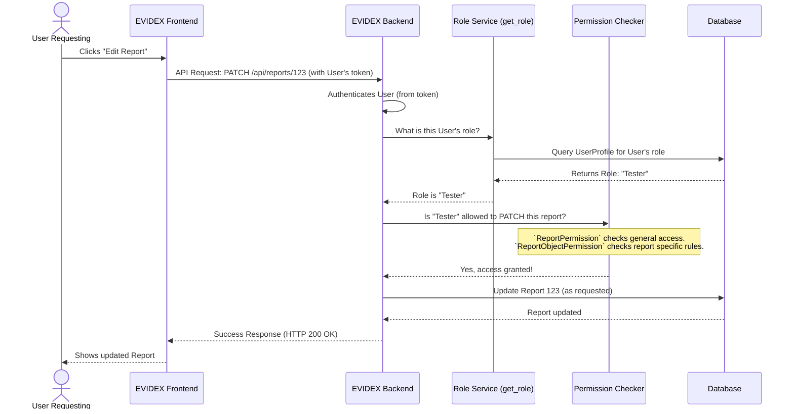
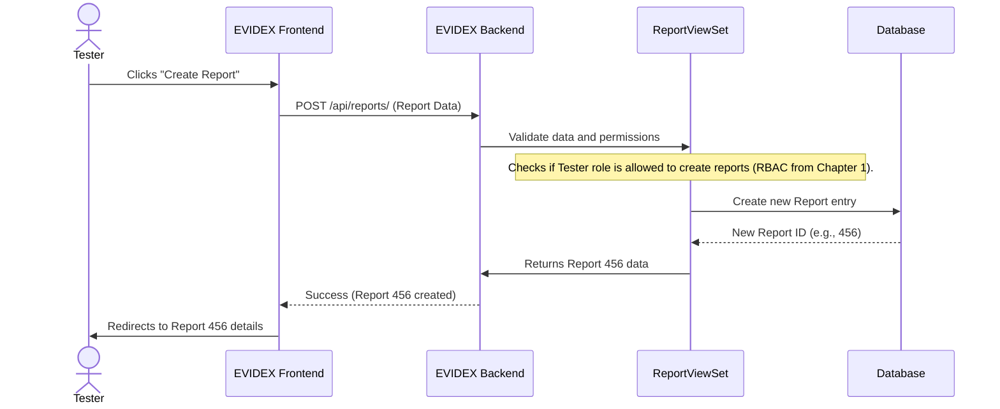
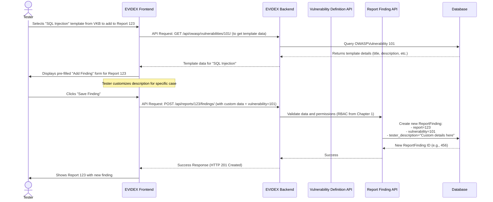
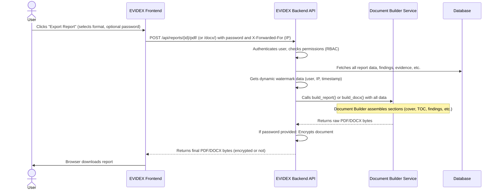
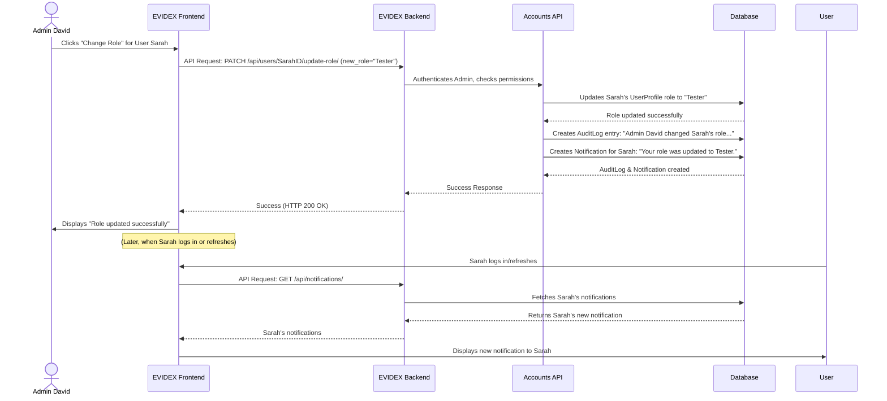
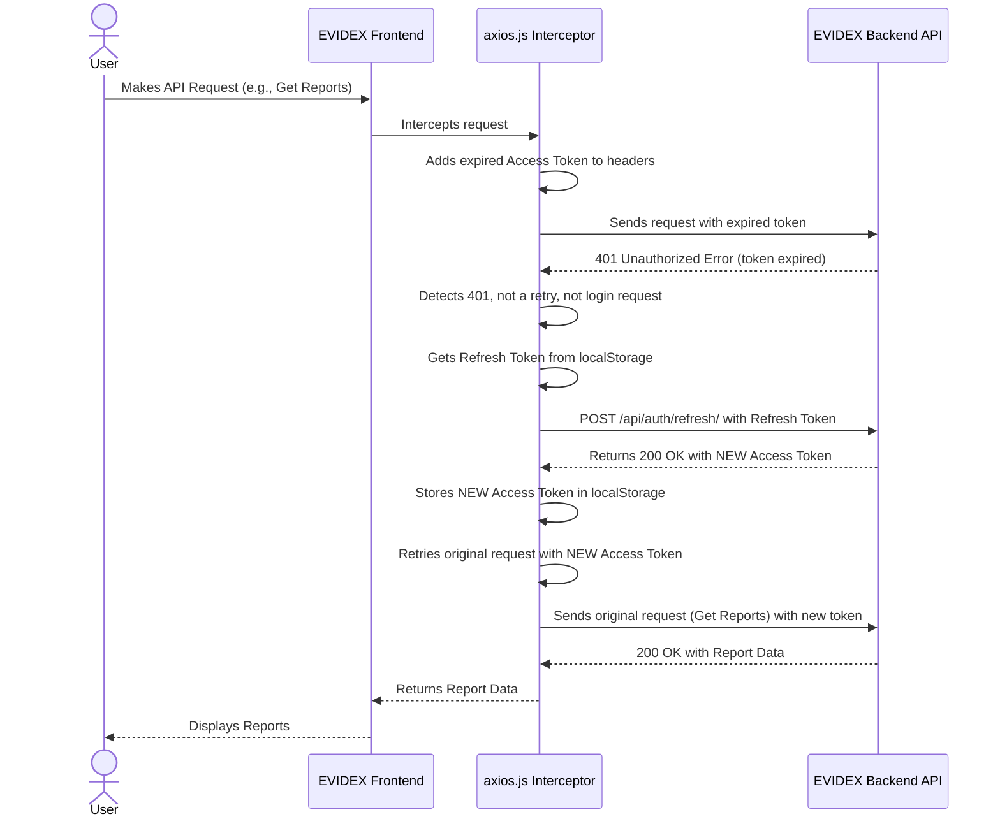

# EVIDEX

EVIDEX is a comprehensive platform for managing **security assessment projects**. It allows security professionals to create *reports* with detailed *findings* and attached evidence, drawing from a central *vulnerability knowledge base*. The system then dynamically generates professional PDF/DOCX documents, all while controlling *user access* with roles and tracking *key activities*.

## BACKEND

👉 **Backend documentation is here:**  
➡️ [Go to backend/README.md](backend/README.md)

### Required Techs

- Docker Desktop
- Python 3.12
- UV ➡️ [Offical Link](https://docs.astral.sh/uv/getting-started/installation/)

### Setup the Backend

#### install the UV [**Installation Steps**](#quick-uv-installation-methode)

#### install the Docker

#### Step 1: Clone the repo or dowmload the repo as zip

 > `https://github.com/EswaranS-06/EVIDEX.git`

#### step 2: Start the Docker Compose for DataBase `docker-compose up -d`

> 1. Check the `.env` file and give required creds and info's
> 2. Run the command `docker-compose up -d` to start the DB
> 3. That shows error check both `.env` and `docker-compose.yml` in same directory if not edit the path in `Line 9` in docker file
> 4. Then run this `docker-compose -f <docker-compose_path> up -d`

#### Step 3: Setup the Python Environment

1. Go to `cd backend/` folder
2. Run `uv sync` this will automatically install and setup the python Environment for Backend

> this to download the package and set-up the python and packages

#### step 4: Start the backend

```powershell
uv run python manage.py makemigrations
uv run python manage.py migrate
uv run python manage.py seed_roles
uv run python manage.py seed_owasp_category
uv run python manage.py seed_owasp_sub
uv run python manage.py seed_owasp_variants
uv run python manage.py seed_testcases
uv run python manage.py runserver
```

#### Step 5: Then Visit the `http://localhost:8000`

#### RUN THE STARTUP SCRIPT TO START THE PROJECT

## Visual Overview



## Chapters

1. [User & Role-Based Access Control (RBAC)](#chapter-1-user--role-based-access-control-rbac)
2. [Report & Finding Management](#chapter-2-report--finding-management)
3. [Vulnerability Knowledge Base](#chapter-3-vulnerability-knowledge-base)
4. [Dynamic Report Generation](#chapter-4-dynamic-report-generation)
5. [Activity Tracking & User Notifications](#chapter-5-activity-tracking--user-notifications)
6. [Frontend Data Integration & State](#chapter-6-frontend-data-integration--state)

---

## Chapter 1: User & Role-Based Access Control (RBAC)

Welcome to the EVIDEX project! In this first chapter, we're going to explore a fundamental concept that keeps our system secure and organized: **User & Role-Based Access Control (RBAC)**.

### The EVIDEX Security Guard: What Problem Does RBAC Solve?

Imagine EVIDEX as a highly secure facility, like a special vault containing important assessment reports. Inside this vault, there are different types of people:

*   Someone who writes the reports (`Tester`).
*   Someone who checks the reports for quality (`Reviewer`).
*   Someone who gives the final stamp of approval (`Approver`).
*   Someone who just needs to see the final, approved reports for their work (`User`).
*   And someone who manages who gets which job (`Admin`).

Now, what if everyone had the same key? A regular "User" could accidentally (or intentionally!) change a critical report status, or an "Approver" might try to create a brand new report, which isn't their job. This would lead to chaos and security risks!

**RBAC is EVIDEX's security guard.** It's a system designed to ensure that each person (or **User**) in our EVIDEX facility only has the exact keys they need to do their job, and nothing more. It determines what each user is allowed to see and do. This prevents unauthorized actions and keeps all our assessment data safe and sound.

### Breaking Down RBAC: Users, Roles, and Permissions

RBAC might sound fancy, but it's built on three simple ideas:

1.  **User:** This is you! Or anyone with an account in EVIDEX. An individual person who logs into the system.
2.  **Role:** Think of a role as a job title, like "Tester" or "Approver". Each role is a collection of specific things a user with that role can do. Instead of giving permissions to individual users, we give them to roles, and then assign roles to users. This makes management much easier!
3.  **Permission:** This is a specific action or ability within EVIDEX. For example, "create report", "change report status", "view all users", or "export data". Roles are simply bundles of these permissions.

In EVIDEX, we have several predefined roles:

| Role        | Who is it for?                                 | What can they generally do?                                  |
| :---------- | :--------------------------------------------- | :----------------------------------------------------------- |
| **Admin**   | System managers                                | Manage users and their roles, see system audit logs.         |
| **Tester**  | People creating and working on assessments     | Create new reports, add findings, change report status (Draft, In Progress, Completed). |
| **Reviewer**| People checking assessment quality             | View, edit, and change status of *completed* reports (to In Progress, Completed, Approved). |
| **Approver**| People giving final approval                   | View, edit, and change status of *completed* reports (to In Progress, Completed, Approved). |
| **User**    | End-users receiving final reports              | View *assigned* reports once they are *Approved*.            |

### How EVIDEX Uses RBAC: A Simple Scenario

Let's walk through a common scenario:
Imagine **User Alice** logs into EVIDEX. She has the **"Tester" role**.
Then, **User Bob** logs in. He has the **"User" role**.

Here's how RBAC would work when they try to do things:

*   **Alice (Tester) wants to create a new report:**
    *   EVIDEX checks Alice's role. It's "Tester".
    *   The "Tester" role has the permission to "create report".
    *   **Result:** Alice can create a new report.

*   **Bob (User) wants to change the status of a report to "Approved":**
    *   EVIDEX checks Bob's role. It's "User".
    *   The "User" role *does not* have the permission to "change report status" or "approve reports".
    *   **Result:** Bob is blocked. He cannot change the report status.

This simple example shows how RBAC ensures that users can only perform actions relevant to their responsibilities, keeping the system secure and data integrity high.

### Under the Hood: How EVIDEX Implements RBAC

Let's peek behind the curtain to see how EVIDEX's code makes RBAC happen.

#### 1. Defining Roles and Connecting Them to Users (Backend)

First, we need to define what a `Role` is and how a `User` gets assigned one. In EVIDEX, we use Django, a Python web framework.

```python
# File: backend/apps/accounts/models.py
from django.db import models
from django.contrib.auth.models import User # Django's built-in User model

class Role(models.Model):
    name = models.CharField(max_length=50, unique=True)
    # description field is omitted for brevity

    def __str__(self):
        return self.name

class UserProfile(models.Model):
    user = models.OneToOneField(User, on_delete=models.CASCADE)
    role = models.ForeignKey(Role, on_delete=models.SET_NULL, null=True)

    def __str__(self):
        return self.user.username
```
**Explanation:**
*   The `Role` model is straightforward: it just has a `name` (like "Admin", "Tester", "User").
*   The `UserProfile` model is crucial. It acts as a bridge, linking Django's standard `User` (which handles basic login) to *our* custom `Role`. Every user gets a `UserProfile` that tells EVIDEX what their role is.

#### 2. Getting a User's Role

Whenever EVIDEX needs to know what a user can do, the first step is always to find out their role. We have a helper function for this:

```python
# File: backend/apps/accounts/utils/role_utils.py
def get_role(user):
    """
    Safely return role name of user
    """
    # Check if the user object exists and has a userprofile with a role
    if not user or not hasattr(user, "userprofile") or not user.userprofile.role:
        return None # Return None if role not found

    return user.userprofile.role.name # Return the role's name (e.g., "Tester")
```
**Explanation:** This small function is called constantly throughout the backend. It takes a `user` object and returns the name of their role. This role name is then used to make permission decisions.

#### 3. Assigning Roles to New Users

When someone registers for EVIDEX, they are automatically given a default role: "User". Only an "Admin" can change this later.

```python
# File: backend/apps/accounts/views.py (simplified part of RegisterUserView)
class RegisterUserView(APIView):
    # ... other code for user registration ...
    def post(self, request):
        # ... user creation logic (simplified) ...
        user = serializer.save()

        # Assign default role = User
        default_role = get_object_or_404(Role, name="User")
        UserProfile.objects.get_or_create(user=user, defaults={'role': default_role})

        return Response({
            "message": "User created successfully",
            "username": user.username,
            "role": default_role.name # Show the assigned role
        }, status=201)
```
**Explanation:** When a new user account is created, EVIDEX looks up the `Role` named "User" and assigns it to the new `UserProfile`.

#### 4. Admins Managing User Roles

Only users with the "Admin" role have the power to change other users' roles. This is a critical security feature to prevent unauthorized role escalation.

```python
# File: backend/apps/accounts/views.py (simplified part of UserManagementUpdateView)
class UserManagementUpdateView(APIView):
    # ... other code ...
    def patch(self, request, pk):
        # Check if the currently logged-in user is an "Admin"
        if self.get_role(request.user) != "Admin":
            return Response({"detail": "Not authorized"}, status=403) # Block if not Admin

        user = get_object_or_404(User, pk=pk) # Get the user to be updated
        profile, created = UserProfile.objects.get_or_create(user=user)

        role_id = request.data.get('role_id')
        if role_id:
            new_role_obj = get_object_or_404(Role, pk=role_id)
            profile.role = new_role_obj # Update the user's role in their profile
            profile.save()

            # ... Audit logging and notification code (omitted for brevity) ...

            return Response({"message": f"Role updated to {new_role_obj.name}"})
        
        return Response({"error": "role_id is required"}, status=400)
```
**Explanation:** Before allowing a role change, EVIDEX first calls `self.get_role(request.user)` to confirm that the person making the request is an "Admin". If not, access is denied (HTTP 403 Forbidden). If they are an Admin, the system finds the target user's `UserProfile` and updates their `role` field.

#### 5. Enforcing Permissions on Backend Actions

This is where `get_role` truly shines! For almost every action a user tries to perform (like creating a report, changing its status, or viewing a finding), EVIDEX checks their role to decide if they're allowed.

```python
# File: backend/apps/knowledge/permissions/report_permissions.py (simplified ReportPermission)
from rest_framework.permissions import BasePermission, SAFE_METHODS
from apps.accounts.utils.role_utils import get_role # Our helper function!

class ReportPermission(BasePermission):
    """
    Controls API-level access to reports (e.g., list all reports, create a new one)
    """
    def has_permission(self, request, view):
        role = get_role(request.user) # Get the current user's role

        # Testers have full access to general report actions
        if role == "Tester":
            return True

        # Reviewers and Approvers can read and make certain updates (PATCH)
        if role in ["Reviewer", "Approver"]:
            return request.method in ["GET", "PATCH", "HEAD", "OPTIONS"]

        # Regular Users can only read (GET) reports
        if role == "User":
            return request.method in SAFE_METHODS # SAFE_METHODS includes GET, HEAD, OPTIONS

        return False # Deny access by default if role doesn't match
```
**Explanation:** This `ReportPermission` is like a bouncer at the door of the "Report Management" section. When a user tries to interact with reports, this bouncer checks their `role`.
*   If you're a "Tester", you're a VIP and can do anything.
*   If you're a "Reviewer" or "Approver", you can read and make specific changes.
*   If you're a "User", you can only look, not touch.
This is a high-level permission check. EVIDEX also has more granular permissions (`ReportObjectPermission`, `ReportStatusPermission`, `FindingPermission`) that check what you can do with a *specific* report or finding, based on its status and who it's assigned to.

#### 6. RBAC in Action: A Backend Flow Diagram

Here's a simplified sequence of events when a user tries to access a restricted part of EVIDEX:


**Explanation:** This diagram illustrates the "security check" process. When you try to do something in EVIDEX, your request travels to the Backend. The Backend quickly asks the `RoleService` for your role. Then, the `PermissionChecker` uses that role information to decide if your action is allowed according to the predefined rules. If all checks pass, your action proceeds!

#### 7. Frontend Role Protection

On the user interface (the website you see), EVIDEX also uses RBAC to determine what content or pages a user can even see.

```jsx
// File: frontend/src/components/ProtectedRoute.jsx (simplified)
import React from 'react';
import { Navigate, Outlet } from 'react-router-dom';
import { useAuth } from '../context/AuthContext';

const ProtectedRoute = ({ roles }) => {
    const { user, loading } = useAuth(); // Get current user info and loading state

    if (loading) {
        return <div>Loading user information...</div>; // Show a loading message
    }

    if (!user) {
        return <Navigate to="/login" replace />; // If not logged in, go to login page
    }

    // Check if the user's role is in the list of allowed 'roles' for this specific route
    if (roles && !roles.includes(user.role)) {
        console.warn(`User with role ${user.role} tried to access unauthorized route.`);
        return <Navigate to="/dashboard" replace />; // If unauthorized role, redirect to dashboard
    }

    return <Outlet />; // If authorized, render the requested page content
};
```
**Explanation:** This React component is used to "guard" entire sections or pages of the EVIDEX application. Before you can see, for example, the "User Management Page" (which is only for Admins), this component checks your `user.role`. If your role isn't in the `roles` list specified for that page, it redirects you away.

```jsx
// File: frontend/src/pages/admin/UserManagementPage.jsx (simplified part)
import React, { useState } from 'react';
import { useUsers, useRoles, useUpdateUserRole } from '../../hooks/useRBAC';
import { useAuth } from '../../context/AuthContext';

const UserManagementPage = () => {
    const { data: users, isLoading: usersLoading } = useUsers();
    const { data: roles } = useRoles();
    const { user: authUser } = useAuth(); // Current logged-in user

    // ... handle searching and selecting users ...

    if (usersLoading) return <div>Loading Users...</div>;

    return (
        <div className="admin-page-container">
            <h1>User Access Management</h1>
            {/* Display a table of users and their roles */}
            <table className="rbac-table">
                <thead>
                    <tr><th>User</th><th>Role</th><th>Access Control</th></tr>
                </thead>
                <tbody>
                    {users?.map(user => (
                        <tr key={user.id}>
                            <td>{user.username}</td>
                            <td>
                                <span className={`role-badge ${user.role?.toLowerCase()}`}>
                                    {user.role || 'User'}
                                </span>
                            </td>
                            <td>
                                {/* Dropdown to change user's role */}
                                <select 
                                    className="admin-select"
                                    value={roles?.find(r => r.name === user.role)?.id || ""}
                                    onChange={(e) => handleQuickRoleChange(e, user.id)}
                                    // Disable if the current user is trying to change their own role or if update is pending
                                    disabled={user.id === authUser?.id || updateRoleMutation.isPending}
                                >
                                    {roles?.map(role => (
                                        <option key={role.id} value={role.id}>{role.name}</option>
                                    ))}
                                </select>
                            </td>
                        </tr>
                    ))}
                </tbody>
            </table>
        </div>
    );
};
```
**Explanation:** This snippet from the `UserManagementPage` shows how "Admins" interact with RBAC. They can see a list of all users and, for each user, a dropdown menu allows them to change that user's role. The frontend also prevents an Admin from changing their *own* role, adding an extra layer of security.

### Conclusion

You've now learned about User & Role-Based Access Control (RBAC) in EVIDEX! You understand that RBAC is like a security guard, assigning specific "Roles" (like Admin, Tester, Reviewer, Approver, or User) to individuals. Each role comes with a predefined set of "Permissions," ensuring that only authorized personnel can perform sensitive operations. This tightly controlled access prevents unauthorized actions and maintains the integrity and confidentiality of the assessment data across the platform.

RBAC is crucial for keeping EVIDEX secure and ensuring everyone can do their job efficiently without stepping on anyone else's toes.

In the next chapter, we will delve into how these permissions come into play as we explore [Report & Finding Management](02_report___finding_management_.md), where you'll see how different roles interact with the core data of EVIDEX.

---

<sub><sup>**References**: [[1]](https://github.com/EswaranS-06/EVIDEX/blob/fc4cf45a0a0cea058404a8bb3c90537629ecf97a/backend/apps/accounts/models.py), [[2]](https://github.com/EswaranS-06/EVIDEX/blob/fc4cf45a0a0cea058404a8bb3c90537629ecf97a/backend/apps/accounts/utils/role_utils.py), [[3]](https://github.com/EswaranS-06/EVIDEX/blob/fc4cf45a0a0cea058404a8bb3c90537629ecf97a/backend/apps/accounts/views.py), [[4]](https://github.com/EswaranS-06/EVIDEX/blob/fc4cf45a0a0cea058404a8bb3c90537629ecf97a/backend/apps/knowledge/permissions/report_permissions.py), [[5]](https://github.com/EswaranS-06/EVIDEX/blob/fc4cf45a0a0cea058404a8bb3c90537629ecf97a/backend/apps/knowledge/rbac_views.py), [[6]](https://github.com/EswaranS-06/EVIDEX/blob/fc4cf45a0a0cea058404a8bb3c90537629ecf97a/frontend/src/components/ProtectedRoute.jsx), [[7]](https://github.com/EswaranS-06/EVIDEX/blob/fc4cf45a0a0cea058404a8bb3c90537629ecf97a/frontend/src/pages/admin/UserManagementPage.jsx)</sup></sub>

---

## Chapter 2: Report & Finding Management

Welcome back to EVIDEX! In our last chapter, [User & Role-Based Access Control (RBAC)](01_user___role_based_access_control__rbac__.md), we learned how EVIDEX keeps things secure by making sure everyone has the right "keys" to do their job. Now, let's open the main vault and explore the heart of EVIDEX: **Report & Finding Management**. This is where all the actual security assessment work happens.

### The EVIDEX Digital Project Binder: What Problem Does It Solve?

Imagine you're a security tester, and your job is to check a company's website for vulnerabilities. You'll spend days or weeks poking, prodding, and trying to break things. Along the way, you'll find various issues, take screenshots, write notes, and eventually, you need to present all this information in a clear, professional report to your client.

Without a system like EVIDEX, this process can be messy:
*   Reports are scattered across different documents.
*   Findings are just notes in various files.
*   Evidence (screenshots, logs) is stored in a separate folder, hard to link to specific issues.
*   Tracking the progress of a report (Is it done? Has someone reviewed it?) is a manual headache.

**Report & Finding Management in EVIDEX solves this by acting as your ultimate digital project binder.** It provides a structured workspace to organize every aspect of your security assessment projects from start to finish. Everything related to a security assessment – from the client's name to every tiny vulnerability you find – lives here, neatly organized and easily accessible.

### Breaking Down the Core Concepts

This system is built around three main ideas:

1.  **Report**: The big picture.
2.  **Finding**: A specific issue within that big picture.
3.  **Evidence**: Proof for each specific issue.

Let's look at each one:

#### 1. Reports: Your Assessment Project Folder

Think of a `Report` as a complete security assessment project. It's like the main folder for "ACME Corp - Customer Portal Penetration Test". It contains all the high-level details about the assessment.

**Key things a Report keeps track of:**

*   **Client & Application**: Who is this for? (e.g., "ACME Corp") What are we testing? (e.g., "Customer Portal").
*   **Dates**: When did the testing start and end?
*   **Personnel**: Who prepared, reviewed, and approved this report?
*   **Status**: Where is this report in its lifecycle? Is it still being worked on, or is it ready for the client?

EVIDEX guides reports through different **statuses**:

| Status         | What it means                                   | Who can usually set it (based on [RBAC](01_user___role_based_access_control__rbac__.md)) |
| :------------- | :---------------------------------------------- | :------------------------------------------------------------------------------------------ |
| **Draft**      | Just started, basic info, not actively testing. | Testers, Admins                                                                             |
| **In Progress**| Actively being tested, findings are being added. | Testers, Admins                                                                             |
| **Completed**  | Testing is finished, report is ready for review. | Testers, Reviewers, Approvers, Admins                                                       |
| **Approved**   | Review is done, report is finalized and approved. | Approvers, Admins                                                                           |

#### 2. Findings: The Specific Issues You Discover

Inside each `Report`, you'll have one or more `Findings`. A `Finding` is a specific security vulnerability you've discovered, like "SQL Injection on Login Page" or "Missing Security Headers".

**Key things a Finding keeps track of:**

*   **Vulnerability Type**: What kind of issue is it? (e.g., "SQL Injection"). This often links to our [Vulnerability Knowledge Base](03_vulnerability_knowledge_base_.md).
*   **Severity**: How bad is it? (e.g., Critical, High, Medium, Low).
*   **Description, Impact, Remediation**: Detailed explanation of the bug, what harm it can cause, and how to fix it.
*   **Status**: Has the client fixed it? (e.g., Pending, Patched, False Positive).

EVIDEX offers a "dual-layer" approach for findings: you can start with a standard vulnerability template (from the knowledge base) and then add your specific observations, tailoring it perfectly to the current assessment.

#### 3. Evidence: Proving Your Point

For every `Finding`, you need `Evidence`. This is the proof that the vulnerability actually exists. Without evidence, a finding is just a claim!

**Key things Evidence includes:**

*   **Screenshots**: Pictures showing the vulnerability in action (e.g., an error message proving SQL injection).
*   **Log Files**: Snippets from server logs or network traffic.
*   **Notes**: Any other relevant details or steps to reproduce the issue.

### Using Report & Finding Management: A Tester's Journey

Let's follow a "Tester" as they create a new report for "Globex Corp - New Web Portal" and add a finding.

#### Step 1: Create a New Report

As a Tester, your first step is to create a new report in EVIDEX. You'll fill in the basic project details through a simple multi-step form.

```jsx
// File: frontend/src/pages/CreateReport.jsx (Simplified JSX for Step 1)
const renderStep1 = () => (
    <div className="animate-fade-in">
        <h2>Organization Information</h2>
        {/* ... Assessment Type selection (Internal/External) ... */}
        {/* ... Test Performed selection (On-site/Off-site) ... */}

        <div className="input-group">
            <label className="input-label">Organization</label>
            <select
                className="input-field"
                value={formData.organizationId}
                onChange={(e) => setFormData({ ...formData, organizationId: e.target.value })}
            >
                <option value="">Select an existing organization</option>
                {/* ... list of existing organizations ... */}
            </select>
            {/* ... or option to create new organization ... */}
        </div>
        <button onClick={nextStep} className="btn btn-primary">Next</button>
    </div>
);
```
**Explanation:** This snippet shows the frontend for the first step where you choose if you're assessing an "Internal" or "External" system, where the test is happening, and which organization you're doing it for (or create a new one). This sets up the fundamental context of your report.

#### Step 2 & 3: Application Details & Timeline

Next, you'd add specifics about the "New Web Portal" (application name, target URLs, tools used) and then set the start/end dates for the assessment, and who is involved.

#### Step 4: Pre-select Common Vulnerabilities

Before even starting, EVIDEX allows you to pre-load common vulnerabilities from its [Vulnerability Knowledge Base](03_vulnerability_knowledge_base_.md) into your report. This saves time and ensures consistency.

```jsx
// File: frontend/src/pages/CreateReport.jsx (Simplified JSX for Step 4)
const renderStep4 = () => (
    <div className="animate-fade-in">
        <h2>Select Vulnerabilities</h2>
        <input type="text" placeholder="Search vulnerabilities..." onChange={(e) => setVulnSearchTerm(e.target.value)} />
        {/* ... filtered list of OWASP categories and vulnerabilities ... */}
        {filteredCategories.map(cat => (
            <div key={cat.id} onClick={() => toggleCategory(cat.id)}>
                <span>{cat.name}</span>
                {expandedCategories.has(cat.id) && (
                    <div>
                        {cat.custom_definitions.map(vuln => (
                            <div key={vuln.id} onClick={() => toggleVuln(vuln.id)}>
                                {vuln.name} - {vuln.default_severity}
                            </div>
                        ))}
                    </div>
                )}
            </div>
        ))}
        <button onClick={handleSubmit} className="btn btn-primary">Create Report</button>
    </div>
);
```
**Explanation:** Here, you can search through the [Vulnerability Knowledge Base](03_vulnerability_knowledge_base_.md), expand categories (like OWASP Top 10), and select specific vulnerabilities. When you "Create Report," these selected vulnerabilities will automatically be added as `Findings` to your new report, ready for you to fill in details.

#### Adding a New Finding and Evidence

Now you're in the actual report. You can see the findings you pre-loaded, or add entirely new custom findings.
Let's say you find a "Broken Authentication" issue.

```jsx
// File: frontend/src/pages/ReportDetails.jsx (Snippet for adding a finding)
// ... inside the Findings section ...
<button className="btn btn-primary" onClick={() => navigate(`/report/${id}/finding/new/edit`)}>
    <Plus size={18} style={{ marginRight: '8px' }} /> Add Custom Finding
</button>
{/* ... list of existing findings ... */}
```
**Explanation:** This button takes you to a new page (`FindingDetail.jsx` in edit mode) where you can either select an existing vulnerability definition from the [Vulnerability Knowledge Base](03_vulnerability_knowledge_base_.md) or write a completely custom one.

Once a finding is created or selected, you can add `Evidence` to it directly.

```jsx
// File: frontend/src/components/EvidenceSection.jsx (Simplified JSX)
const EvidenceSection = ({ findingId }) => {
    const [evidenceList, setEvidenceList] = useState([]);
    const [newEvidence, setNewEvidence] = useState({ title: '', file: null });

    const handleAddEvidence = async () => {
        // ... validation ...
        const formData = new FormData();
        formData.append('title', newEvidence.title);
        formData.append('file', newEvidence.file);
        // ... send to backend ...
        await uploadEvidence(findingId, formData);
        // ... refresh list ...
    };

    return (
        <div>
            <h2>Evidence ({evidenceList.length})</h2>
            <input type="text" value={newEvidence.title} onChange={/* ... */} placeholder="Evidence Title" />
            <input type="file" onChange={/* ... */} />
            <button onClick={handleAddEvidence}>Upload Evidence</button>
            {evidenceList.map(item => (
                <div key={item.id}>
                    <h3>{item.title}</h3>
                    {item.file && }
                </div>
            ))}
        </div>
    );
};
```
**Explanation:** The `EvidenceSection` component allows you to add a title, description, and upload a file (like a screenshot) directly associated with a specific finding. These can also be reordered easily.

#### Changing Report Status

Once all findings are added and detailed, a Tester can change the report's status to "Completed". A Reviewer would then check it, and an Approver would give the final "Approved" status. This workflow is critical for quality control.

```jsx
// File: frontend/src/pages/ReportDetails.jsx (Snippet for status change)
// ... inside the Report Details header ...
<select
    className="input-field"
    value={report.status || 'in_progress'}
    onChange={(e) => setReport({ ...report, status: e.target.value })}
>
    <option value="draft">Draft</option>
    <option value="in_progress">In Progress</option>
    <option value="completed">Completed</option>
    <option value="approved">Approved</option>
</select>
// ...
```
**Explanation:** This dropdown allows authorized users (as per [RBAC](01_user___role_based_access_control__rbac__.md) rules) to update the report's lifecycle status. For instance, a "Tester" could move it from "In Progress" to "Completed", and an "Approver" could then move it to "Approved."

### Under the Hood: How EVIDEX Organizes Reports and Findings

Let's peek behind the curtain to see how EVIDEX's code structures and manages this core functionality.

#### 1. The Data Models

EVIDEX uses Django models to define how `Report`, `ReportFinding`, and `FindingEvidence` data are stored in the database.

```python
# File: backend/apps/knowledge/models.py (Simplified)
from django.db import models
from django.contrib.auth.models import User
# from apps.knowledge.models import VulnerabilityDefinition (imported implicitly)

class Report(models.Model):
    STATUS_CHOICES = [
        ('draft', 'Draft'), ('in_progress', 'In Progress'),
        ('completed', 'Completed'), ('approved', 'Approved'),
    ]
    client_name = models.CharField(max_length=200)
    application_name = models.CharField(max_length=200)
    status = models.CharField(max_length=20, choices=STATUS_CHOICES, default='in_progress')
    created_by = models.ForeignKey(User, on_delete=models.CASCADE, related_name="created_reports")
    # ... other fields like start_date, end_date, prepared_by ...

    def __str__(self):
        return f"{self.client_name} - {self.application_name}"

class ReportFinding(models.Model):
    report = models.ForeignKey(Report, on_delete=models.CASCADE, related_name="findings", null=True)
    vulnerability = models.ForeignKey(
        'VulnerabilityDefinition', # Links to Chapter 3's core model
        on_delete=models.SET_NULL, null=True, blank=True, related_name="report_findings"
    )
    tester_title = models.CharField(max_length=200, blank=True)
    tester_severity = models.CharField(max_length=20, blank=True)
    tester_description = models.TextField(blank=True)
    # ... other tester_ fields for impact and remediation ...

    # Properties to combine default (from vulnerability) and tester-specific data
    @property
    def final_title(self):
        return self.tester_title or (self.vulnerability.title if self.vulnerability else "")
    # ... similar properties for final_severity, final_description, etc. ...

class FindingEvidence(models.Model):
    finding = models.ForeignKey(ReportFinding, on_delete=models.CASCADE, related_name="evidences")
    title = models.CharField(max_length=200, blank=True)
    file = models.FileField(upload_to="evidence/")
    # ... other fields like description, order ...
```
**Explanation:**
*   **Report**: Represents the overall assessment. It has fields for client name, application name, status, and who created it.
*   **ReportFinding**: This is the key. It links to a `Report` (meaning it belongs to that assessment) and optionally to a `VulnerabilityDefinition` (a template from the [Vulnerability Knowledge Base](03_vulnerability_knowledge_base_.md)). Crucially, it has `tester_` fields (`tester_title`, `tester_severity`, etc.) which allow testers to customize the details, even if a `vulnerability` template is used. The `@property` methods (`final_title`, `final_severity`) ensure that if a tester hasn't provided custom info, the details from the linked `VulnerabilityDefinition` are used.
*   **FindingEvidence**: Stores the proof for a `ReportFinding`, including a title and the uploaded file itself.

#### 2. Backend Logic: Creating a Report

When a Tester submits the "Create Report" form, here's a simplified sequence of events:


**Explanation:** The Tester's request goes to the backend, which validates the data and checks permissions. If everything is good, a new `Report` record is created in the database, and the user is redirected to view their new report.

The actual saving is handled by the `perform_create` method in the `ReportViewSet`:

```python
# File: backend/apps/knowledge/report_views.py (Simplified)
from rest_framework.viewsets import ModelViewSet
from apps.knowledge.models import Report
from apps.knowledge.serializers import ReportSerializer

class ReportViewSet(ModelViewSet):
    serializer_class = ReportSerializer
    # ... permission_classes and get_queryset (filtered by RBAC role) ...

    def perform_create(self, serializer):
        # Automatically set the creator and initial 'prepared_by' field
        serializer.save(created_by=self.request.user, prepared_by=self.request.user.username)

    def perform_update(self, serializer):
        # ... logic for status changes and audit logs ...
        instance = self.get_object()
        user = self.request.user
        old_status = instance.status

        # Prevent direct changes to sensitive fields (handled in serializer read_only too)
        serializer.validated_data.pop('prepared_by', None)
        serializer.validated_data.pop('reviewed_by', None)
        serializer.validated_data.pop('approved_by', None)

        # Apply updates and track who made the last change
        instance = serializer.save(updated_by=user)
        
        # Log status changes
        if old_status != instance.status:
            # log_audit() # Reference to Chapter 5
            pass # Simplified
```
**Explanation:**
*   When a new report is created, EVIDEX automatically assigns the currently logged-in user as the `created_by` and the initial `prepared_by` person.
*   When a report is updated (like changing its status), EVIDEX explicitly tracks who made the `updated_by` change. It also contains logic to prevent unauthorized status changes (e.g., a "Tester" cannot directly "Approve" a report), which ties back to our [RBAC](01_user___role_based_access_control__rbac__.md) rules. It also prevents tampering with "prepared_by", "reviewed_by", "approved_by" fields directly via the API, ensuring a proper audit trail.

#### 3. Backend Logic: Managing Findings and Evidence

Adding a finding or evidence is similar. The frontend sends data to specific API endpoints, and the backend handles the creation and storage.

```python
# File: backend/apps/knowledge/report_views.py (Simplified)
from rest_framework.views import APIView
from rest_framework.response import Response
from rest_framework import status
from django.shortcuts import get_object_or_404
from apps.knowledge.models import Report, ReportFinding, FindingEvidence
from apps.knowledge.serializers import ReportFindingSerializer, FindingEvidenceSerializer
from .permissions.report_permissions import FindingPermission # From Chapter 1

class ReportFindingListCreateView(APIView):
    permission_classes = [FindingPermission] # RBAC check

    def post(self, request, report_id):
        report = get_object_or_404(Report, id=report_id) # Ensure report exists
        serializer = ReportFindingSerializer(data=request.data)
        if serializer.is_valid():
            finding = serializer.save(report=report, updated_by=request.user) # Link to report & user
            return Response(ReportFindingSerializer(finding).data, status=status.HTTP_201_CREATED)
        return Response(serializer.errors, status=status.HTTP_400_BAD_REQUEST)

class EvidenceListCreateView(APIView):
    permission_classes = [FindingPermission] # RBAC check

    def post(self, request, finding_id):
        # Note: Finding ID is passed via URL, not in request.data directly
        serializer = FindingEvidenceSerializer(data=request.data)
        if serializer.is_valid():
            serializer.save(finding_id=finding_id, updated_by=request.user) # Link to finding & user
            return Response(serializer.data, status=status.HTTP_201_CREATED)
        return Response(serializer.errors, status=status.HTTP_400_BAD_REQUEST)
```
**Explanation:**
*   `ReportFindingListCreateView.post`: This view handles creating new `ReportFinding` instances. It takes the data for the finding, links it to the correct `Report` using the `report_id` from the URL, and assigns the current user as the `updated_by` person. It also uses `FindingPermission` to check if the user has the right role to add findings to this report.
*   `EvidenceListCreateView.post`: Similarly, this view creates `FindingEvidence` records, linking them to a specific `ReportFinding` and storing the uploaded file.

#### 4. Frontend Interaction

The frontend (`ReportDetails.jsx`, `FindingDetail.jsx`, `EvidenceSection.jsx`) are the user-facing parts that consume these APIs. They display the report and finding data, allow users to input new information, and send requests to the backend. They also use the computed properties (`final_title`, `final_severity`) of `ReportFinding` to show the most relevant data.

```jsx
// File: frontend/src/pages/FindingDetail.jsx (Simplified for display)
const FindingDetail = () => {
    const [finding, setFinding] = useState(null);
    // ... fetch finding details from API ...

    if (!finding) return <div>Loading...</div>;

    return (
        <div>
            <h1>{finding.final_title || 'Untitled Finding'}</h1>
            <span>Severity: {finding.final_severity}</span>
            <p>Description: {finding.final_description}</p>
            {/* ... other details ... */}
            <EvidenceSection findingId={finding.id} /> {/* Renders the EvidenceSection component */}
        </div>
    );
};
```
**Explanation:** This snippet from `FindingDetail.jsx` shows how the frontend directly uses `finding.final_title`, `finding.final_severity`, and `finding.final_description` to display the consolidated information, whether it comes from a vulnerability template or custom input from the tester. It also embeds the `EvidenceSection` to manage proof for the current finding.

### Conclusion

You've now successfully navigated the core of EVIDEX: **Report & Finding Management**! You understand that `Reports` are like project binders, containing all the details of an assessment. Within these, `Findings` pinpoint specific security issues, each backed up by `Evidence` to prove its existence. EVIDEX provides a structured, guided workflow to manage these from creation through to final approval, with built-in mechanisms for data consistency and role-based access.

This structure is crucial for accurate, professional security assessments. In the next chapter, we'll dive deeper into the [Vulnerability Knowledge Base](03_vulnerability_knowledge_base_.md), which serves as the powerful foundation for populating your reports with well-defined and standardized findings.

---

<sub><sup>**References**: [[1]](https://github.com/EswaranS-06/EVIDEX/blob/fc4cf45a0a0cea058404a8bb3c90537629ecf97a/backend/apps/knowledge/models.py), [[2]](https://github.com/EswaranS-06/EVIDEX/blob/fc4cf45a0a0cea058404a8bb3c90537629ecf97a/backend/apps/knowledge/report_views.py), [[3]](https://github.com/EswaranS-06/EVIDEX/blob/fc4cf45a0a0cea058404a8bb3c90537629ecf97a/backend/apps/knowledge/serializers.py), [[4]](https://github.com/EswaranS-06/EVIDEX/blob/fc4cf45a0a0cea058404a8bb3c90537629ecf97a/frontend/src/components/EvidenceSection.jsx), [[5]](https://github.com/EswaranS-06/EVIDEX/blob/fc4cf45a0a0cea058404a8bb3c90537629ecf97a/frontend/src/pages/CreateReport.jsx), [[6]](https://github.com/EswaranS-06/EVIDEX/blob/fc4cf45a0a0cea058404a8bb3c90537629ecf97a/frontend/src/pages/FindingDetail.jsx), [[7]](https://github.com/EswaranS-06/EVIDEX/blob/fc4cf45a0a0cea058404a8bb3c90537629ecf97a/frontend/src/pages/ReportDetails.jsx)</sup></sub>

---

## Chapter 3: Vulnerability Knowledge Base

Welcome back to EVIDEX! In our last chapter, [Report & Finding Management](02_report___finding_management_.md), we explored how EVIDEX helps you organize your security assessment projects into `Reports` and pinpoint specific issues as `Findings`. Now, let's talk about the secret weapon that makes adding those `Findings` incredibly efficient and consistent: the **Vulnerability Knowledge Base**.

### The EVIDEX Encyclopedia: What Problem Does It Solve?

Imagine you're a security tester, and you've found "Cross-Site Scripting (XSS)" for the tenth time this month. Each time, you have to write a title, a description, explain its impact, and suggest remediation steps. This is repetitive, time-consuming, and prone to inconsistencies if different testers phrase things differently.

**The EVIDEX Vulnerability Knowledge Base (VKB) is your central encyclopedia of security vulnerabilities.** Think of it as a huge library of pre-written "recipe cards" for common security issues. Instead of writing everything from scratch, you can pick a card (a `VulnerabilityDefinition`), and EVIDEX automatically fills in the standard details like the title, description, impact, and remediation steps.

This solves several key problems:
*   **Consistency**: Everyone uses the same, approved language for a given vulnerability.
*   **Speed**: Testers save a lot of time by not re-typing common information.
*   **Quality**: Standardized information means higher quality reports.
*   **Learning**: It helps new testers learn about common vulnerabilities and best practices.

And the best part? You can also add your *own custom* vulnerability definitions to this library, making it perfectly tailored to your team's needs!

### Breaking Down the Core Concepts: Vulnerability Definitions

The heart of the VKB is the `VulnerabilityDefinition`. This is a single entry in our encyclopedia, a template that describes a known security issue.

**Key things a `VulnerabilityDefinition` keeps track of:**

*   **Title**: A standard name for the vulnerability (e.g., "SQL Injection").
*   **Severity**: How severe the issue typically is (e.g., Critical, High, Medium, Low).
*   **Description**: A detailed explanation of the vulnerability.
*   **Impact**: What kind of harm can this vulnerability cause?
*   **Remediation**: Steps to fix the vulnerability.
*   **Source Type**: Where did this definition come from? (e.g., OWASP, CVE, Custom).
*   **Categorization**: How it's organized, often by standards like OWASP Top 10.
*   **References**: Links to external resources for more information.

In EVIDEX, these definitions are organized into `OWASPCategory` (like "Injection" or "Broken Authentication") and can even have `OWASPVulnerability` (like "SQL Injection" under "Injection") and `VulnerabilityVariant` for more specific types. This structure makes it easy to find what you're looking for.

### Using the Knowledge Base: A Tester's Workflow

Let's see how a Tester would use the VKB to add a finding to an existing report.

#### Step 1: Browse the Vulnerability Library

First, you might want to explore the available vulnerability definitions or create a new custom one. You'd navigate to the "Vulnerabilities Library" section in EVIDEX.

```jsx
// File: frontend/src/pages/Vulnerabilities.jsx (Simplified View)
const Vulnerabilities = () => {
    // ... state and data fetching ...

    return (
        <div className="vulnerabilities-page">
            <h1>Vulnerabilities Library</h1>
            <input type="text" placeholder="Search vulnerabilities..." />
            <button onClick={() => navigate('/finding/new')}>
                <Plus size={20} /> NEW DEFINITION
            </button>

            {/* Displaying categorized vulnerabilities */}
            <div className="glass-panel">
                {filteredCategories.map(cat => (
                    <div key={cat.id} onClick={() => toggleCategory(cat.id)}>
                        <h3>{cat.name}</h3>
                        {expandedCategories.has(cat.id) && (
                            <div>
                                {/* Custom Definitions you've added */}
                                {cat.custom_definitions.map(v => (
                                    <div key={v.id} onClick={() => navigate(`/finding/${v.id}`)}>
                                        <span>{v.name}</span> {/* Your custom title */}
                                    </div>
                                ))}
                                {/* Standard OWASP templates */}
                                {cat.standard_vulnerabilities.map(v => (
                                    <div key={v.id} onClick={() => navigate(`/finding/new?owasp_vuln=${v.id}&cat=${cat.id}`)}>
                                        <span>{v.name}</span> {/* OWASP template title */}
                                    </div>
                                ))}
                            </div>
                        )}
                    </div>
                ))}
            </div>
            {/* ... other code ... */}
        </div>
    );
};
```
**Explanation:** This part of the frontend shows you a list of OWASP categories. You can expand them to see both standard vulnerability templates (like "SQL Injection" from OWASP) and any custom definitions your team has added. You can search, or click to add a new definition to the library (`/finding/new`).

#### Step 2: Adding a New Finding to a Report (with VKB)

When you're working on a [Report](02_report___finding_management_.md) and want to add a new `Finding`, you'll have the option to pick from the VKB.

```jsx
// File: frontend/src/pages/FindingDetail.jsx (Simplified for adding a finding to a report)
const FindingDetail = () => {
    // ... other states and effects ...

    // Assume `reportId` is available from URL params
    const isNewFindingForReport = reportId && id === 'new';

    useEffect(() => {
        // ... if creating a new finding for a report and `owasp_vuln` is in URL params ...
        const queryParams = new URLSearchParams(window.location.search);
        const prefillVulnId = queryParams.get('owasp_vuln');
        const prefillCatId = queryParams.get('cat');

        if (isNewFindingForReport && prefillVulnId) {
            const fetchTemplate = async () => {
                const response = await api.get(`/api/owasp/vulnerabilities/${prefillVulnId}/`);
                const v = response.data;
                // Pre-fill form fields with template data
                setOwaspVulnerability(prefillVulnId);
                setTitle(v.name);
                setSeverity(v.default_severity);
                setDescription(v.description);
                setImpact(v.default_impact);
                setRemediation(v.default_remediation);
                setSourceType('OWASP');
                if (prefillCatId) setOwaspCategory(prefillCatId);
                // Mark changes so it can be saved as a new finding
                setHasUnsavedChanges(true);
            };
            fetchTemplate();
        }
    }, [id, reportId, isNewFindingForReport]);

    // ... form for editing title, severity, description etc. ...
    // ... saveChanges function ...
};
```
**Explanation:** When you click on a "Standard Template" in the `Vulnerabilities` page (like "SQL Injection"), EVIDEX directs you to the "Add New Finding" page (`FindingDetail.jsx`). It passes the `owasp_vuln` ID in the URL. The `useEffect` hook catches this ID, fetches the template's details (title, description, etc.), and *pre-fills* your new `Finding` form. You then only need to add specific details about *this particular instance* of SQL injection.

#### Step 3: Customizing Pre-filled Details & Saving

Even if you use a template, you can always adjust the details to fit your specific finding in the report. For instance, the "Impact" of a generic "SQL Injection" might be "Data Compromise," but for *your specific finding*, it might be "Compromise of specific user data due to lack of input validation on field X."

After customization, you save the `Finding`, which gets linked to the template (if used) but stores your specific observations.

### Under the Hood: How EVIDEX Organizes the Knowledge Base

Let's peek behind the curtain to see how EVIDEX's code manages the Vulnerability Knowledge Base.

#### 1. The Data Models: Defining Vulnerability Information

EVIDEX uses several Django models to structure the VKB.

```python
# File: backend/apps/knowledge/models.py (Simplified)
from django.db import models
from django.contrib.auth.models import User

# 1️⃣ OWASP Category: Top-level grouping (e.g., A01:2021-Broken Access Control)
class OWASPCategory(models.Model):
    name = models.CharField(max_length=100, unique=True)
    description = models.TextField(blank=True)
    def __str__(self): return self.name

# 2️⃣ OWASP Vulnerability: Specific vulnerability under a category (e.g., SQL Injection)
class OWASPVulnerability(models.Model):
    category = models.ForeignKey(OWASPCategory, on_delete=models.CASCADE, related_name="vulnerabilities")
    name = models.CharField(max_length=150)
    description = models.TextField()
    default_severity = models.CharField(max_length=20)
    default_impact = models.TextField()
    default_remediation = models.TextField()
    def __str__(self): return self.name

# 3️⃣ Vulnerability Variant: Even more specific type (e.g., Blind SQL Injection)
class VulnerabilityVariant(models.Model):
    owasp_vulnerability = models.ForeignKey(OWASPVulnerability, on_delete=models.CASCADE, related_name="variants")
    name = models.CharField(max_length=150)
    description = models.TextField(blank=True)
    def __str__(self): return self.name

# 4️⃣ Vulnerability Definition (CORE TABLE): The actual template in the VKB
class VulnerabilityDefinition(models.Model):
    SOURCE_CHOICES = [("OWASP", "OWASP"), ("CVE", "CVE"), ("CUSTOM", "Custom")]
    title = models.CharField(max_length=200)
    source_type = models.CharField(max_length=20, choices=SOURCE_CHOICES)
    severity = models.CharField(max_length=20, choices=[("CRITICAL", "Critical"), ("HIGH", "High"), ("MEDIUM", "Medium"), ("LOW", "Low")])
    description = models.TextField()
    impact = models.TextField()
    remediation = models.TextField()
    references = models.TextField(blank=True)

    # Optional linkages for categorization
    owasp_category = models.ForeignKey(OWASPCategory, on_delete=models.SET_NULL, null=True, blank=True)
    owasp_vulnerability = models.ForeignKey(OWASPVulnerability, on_delete=models.SET_NULL, null=True, blank=True)
    variant = models.ForeignKey(VulnerabilityVariant, on_delete=models.SET_NULL, null=True, blank=True)
    
    # Optional CVE information
    cve_id = models.CharField(max_length=50, null=True, blank=True)
    cvss_score = models.FloatField(null=True, blank=True)
    cvss_vector = models.CharField(max_length=200, null=True, blank=True)

    created_by = models.ForeignKey(User, on_delete=models.SET_NULL, null=True)
    # ... timestamps ...

    def __str__(self): return self.title
```
**Explanation:**
*   `OWASPCategory`, `OWASPVulnerability`, `VulnerabilityVariant`: These models define the standard OWASP structure. They act as "parent templates" for common, well-known vulnerabilities.
*   `VulnerabilityDefinition`: This is the core of our VKB. Each entry here is a reusable template. It can either *link* to one of the standard OWASP types (pre-filled by EVIDEX with data from the `OWASPVulnerability` model) or be a completely `CUSTOM` definition created by a user. It stores all the detailed information (title, description, etc.) that can be reused in reports.

#### 2. Linking to Report Findings

In [Chapter 2: Report & Finding Management](02_report___finding_management_.md), we saw the `ReportFinding` model. It has a crucial link to our `VulnerabilityDefinition`:

```python
# File: backend/apps/knowledge/models.py (Snippet from ReportFinding)
# ...
class ReportFinding(models.Model):
    report = models.ForeignKey(Report, on_delete=models.CASCADE, related_name="findings")
    vulnerability = models.ForeignKey(
        'VulnerabilityDefinition', # Links to the VKB!
        on_delete=models.SET_NULL, null=True, blank=True, related_name="report_findings"
    )
    
    # These are the *tester's specific observations*, overriding or extending the template
    tester_title = models.CharField(max_length=200, blank=True)
    tester_severity = models.CharField(max_length=20, blank=True)
    tester_description = models.TextField(blank=True)
    # ... tester_impact, tester_remediation ...

    # Properties to combine default (from vulnerability) and tester-specific data
    @property
    def final_title(self):
        return self.tester_title or (self.vulnerability.title if self.vulnerability else "")
    # ... similar properties for final_severity, final_description, etc. ...
# ...
```
**Explanation:**
*   The `vulnerability` field is a `ForeignKey` that points to a `VulnerabilityDefinition` in the VKB. This is how a `ReportFinding` knows which template it's based on.
*   The `tester_title`, `tester_severity`, etc., fields allow the tester to customize the finding for a specific report. If these fields are empty, the `@property` methods (`final_title`, `final_severity`) will automatically pull the data from the linked `VulnerabilityDefinition`. This is the "dual-layer" approach mentioned earlier!

#### 3. Backend Logic: Managing Definitions

`VulnerabilityDefinition` entries are managed via standard API views.

```python
# File: backend/apps/knowledge/views.py (Simplified)
from rest_framework import generics
from rest_framework.permissions import IsAuthenticated
from .permissions.knowledge_permissions import KnowledgePermission # From Chapter 1

from .models import VulnerabilityDefinition
from .serializers import VulnerabilityDefinitionSerializer

class VulnerabilityDefinitionListCreateView(generics.ListCreateAPIView):
    queryset = VulnerabilityDefinition.objects.all()
    serializer_class = VulnerabilityDefinitionSerializer
    permission_classes = [IsAuthenticated, KnowledgePermission] # Only authorized users can manage

    def perform_create(self, serializer):
        # Automatically set the creator of the definition
        serializer.save(created_by=self.request.user)

class VulnerabilityDefinitionDetailView(generics.RetrieveUpdateDestroyAPIView):
    queryset = VulnerabilityDefinition.objects.all()
    serializer_class = VulnerabilityDefinitionSerializer
    permission_classes = [IsAuthenticated, KnowledgePermission]
```
**Explanation:**
*   `VulnerabilityDefinitionListCreateView`: This API endpoint allows authorized users (like Admins or Testers, depending on the `KnowledgePermission` rules from [Chapter 1: User & Role-Based Access Control (RBAC)](01_user___role_based_access_control__rbac__.md)) to view all `VulnerabilityDefinition` entries or create new ones. When a new definition is created, the system automatically records `created_by` as the current user.
*   `VulnerabilityDefinitionDetailView`: This allows users to retrieve, update, or delete a *specific* `VulnerabilityDefinition` entry by its ID.

#### 4. Backend Logic: Seeding Initial OWASP Data

EVIDEX also comes pre-loaded with standard OWASP definitions. This is done using a Django management command.

```python
# File: backend/apps/knowledge/management/commands/seed_testcases.py (Simplified)
# ... imports ...
class Command(BaseCommand):
    help = "Seed OWASP 2025 testcases into VulnerabilityDefinition"

    def handle(self, *args, **kwargs):
        # ... locate JSON file with OWASP data ...
        with open("testcases_owasp_2025.json", "r", encoding="utf-8") as f:
            data = json.load(f)

        for tc in data.get("testcases", []):
            # ... lookup/create OWASPCategory, OWASPVulnerability, VulnerabilityVariant ...
            # Get or create the VulnerabilityDefinition based on the OWASP template
            obj, is_created = VulnerabilityDefinition.objects.get_or_create(
                title=tc.get("title"),
                defaults={
                    "source_type": "OWASP",
                    "severity": tc.get("severity", "MEDIUM"),
                    "description": tc.get("description", ""),
                    "impact": normalize_text(tc.get("impact")),
                    "remediation": normalize_text(tc.get("remediation")),
                    "owasp_category": category_obj, # Link to category
                    "owasp_vulnerability": vuln_obj, # Link to OWASP vuln
                    "variant": variant_obj, # Link to variant
                    # ... other fields ...
                },
            )
            # ... count created/skipped ...
        self.stdout.write(self.style.SUCCESS(f"✅ Testcases seeded successfully!"))
```
**Explanation:** This command reads a JSON file containing official OWASP 2025 definitions. For each entry, it creates (or finds existing) `OWASPCategory`, `OWASPVulnerability`, and `VulnerabilityVariant` records. Then, it creates a `VulnerabilityDefinition` that links to these standard OWASP models and contains all the pre-defined details. This is how EVIDEX gets its initial "library" content.

#### 5. VKB in Action: Adding a Template-Based Finding

Here's a simplified flow when a Tester adds a finding using a VKB template:


**Explanation:** This diagram shows how the frontend first fetches the generic template data, allows the tester to customize it, and then sends the specific finding details (linked to the template) to the backend. The backend stores this `ReportFinding`, ready for further evidence collection and reporting.

### Conclusion

You've now explored the invaluable **Vulnerability Knowledge Base** in EVIDEX! You understand that it serves as a central library of `VulnerabilityDefinition` templates, ensuring consistent, high-quality, and efficient reporting of security findings. By providing predefined titles, descriptions, impacts, and remediation steps, the VKB saves testers significant time and standardizes terminology across all assessments. Plus, the ability to add custom definitions makes it a flexible tool perfectly suited to your team's unique requirements.

This structured approach to vulnerability definitions is a foundational element for what comes next. In the next chapter, we'll see how all this information—reports, findings, and the knowledge base—comes together to create professional, client-ready documents as we explore [Dynamic Report Generation](04_dynamic_report_generation_.md).

---

<sub><sup>**References**: [[1]](https://github.com/EswaranS-06/EVIDEX/blob/fc4cf45a0a0cea058404a8bb3c90537629ecf97a/backend/apps/knowledge/management/commands/seed_testcases.py), [[2]](https://github.com/EswaranS-06/EVIDEX/blob/fc4cf45a0a0cea058404a8bb3c90537629ecf97a/backend/apps/knowledge/models.py), [[3]](https://github.com/EswaranS-06/EVIDEX/blob/fc4cf45a0a0cea058404a8bb3c90537629ecf97a/backend/apps/knowledge/serializers.py), [[4]](https://github.com/EswaranS-06/EVIDEX/blob/fc4cf45a0a0cea058404a8bb3c90537629ecf97a/backend/apps/knowledge/views.py), [[5]](https://github.com/EswaranS-06/EVIDEX/blob/fc4cf45a0a0cea058404a8bb3c90537629ecf97a/frontend/src/pages/VulnDetail.jsx), [[6]](https://github.com/EswaranS-06/EVIDEX/blob/fc4cf45a0a0cea058404a8bb3c90537629ecf97a/frontend/src/pages/Vulnerabilities.jsx)</sup></sub>

---

## Chapter 4: Dynamic Report Generation

Welcome back to EVIDEX! In our last chapter, [Vulnerability Knowledge Base](03_vulnerability_knowledge_base_.md), we saw how EVIDEX helps you standardize and efficiently manage information about security vulnerabilities. Now, imagine you've spent days carefully conducting an assessment, documenting every finding, and collecting crucial evidence. What's next? You need to present all this hard work in a clear, professional report to your client or stakeholders.

### The EVIDEX Publishing House: What Problem Does It Solve?

Remember that messy process of creating reports we talked about? Copying and pasting findings into a Word document, manually formatting tables, inserting screenshots, ensuring consistent branding, and then converting it to PDF? It's tedious, error-prone, and takes valuable time away from actual security work.

**Dynamic Report Generation in EVIDEX is your sophisticated publishing house.** It takes *all* the structured data you've meticulously entered – client details, application information, findings, evidence, and even who reviewed and approved it – and automatically transforms it into professional, perfectly formatted PDF and DOCX documents. It handles all the layout, styling, and content population for you.

This powerful feature solves several key problems:
*   **Time Savings**: No more manual formatting. Generate a full report in seconds.
*   **Consistency & Professionalism**: Ensures every report looks uniform, branded, and highly professional, reflecting well on your team.
*   **Accuracy**: Directly pulls data from your assessment, reducing copy-paste errors.
*   **Security & Branding**: Adds optional password protection and dynamic watermarks for secure, branded sharing.

### Breaking Down the Core Concepts

The magic of dynamic report generation relies on EVIDEX understanding your data and knowing how to lay it out.

1.  **The Report Blueprint**: EVIDEX treats your entire [Report](02_report___finding_management_.md) as a blueprint. It gathers all associated information:
    *   Client and application details.
    *   All [Findings](02_report___finding_management_.md) linked to the report.
    *   All [Evidence](02_report___finding_management_.md) for each finding.
    *   Roles of people involved (prepared by, reviewed by, approved by).
    *   Assessment dates, scope, and tools used.

2.  **Document Formats (PDF & DOCX)**: EVIDEX generates reports in two widely used formats:
    *   **PDF (Portable Document Format)**: Ideal for sharing final reports, as it maintains formatting across different devices and cannot be easily altered.
    *   **DOCX (Microsoft Word Document)**: Useful if clients need to make minor internal edits or copy content directly.

3.  **Layout, Styling & Content Population**: This is where EVIDEX does the heavy lifting. It has predefined templates for different sections of a report (cover page, executive summary, methodology, findings, conclusion). It intelligently inserts your report data into these templates, automatically handling:
    *   Headings, subheadings, and body text.
    *   Tables for findings and their severity.
    *   Embedding images (evidence) with captions.
    *   Page numbering, table of contents, and other structural elements.

4.  **Advanced Features**:
    *   **Optional Password Protection**: For sensitive reports, you can add a password, ensuring only authorized recipients can open the document.
    *   **Dynamic Watermarking**: To prevent unauthorized sharing or leakage, EVIDEX can add a watermark with the downloader's username, ID, IP address, and timestamp directly onto each page of the report. This means every generated report is unique to the person who downloaded it.

### Generating a Report: A User's Workflow

Let's walk through how you, as a user with appropriate permissions (e.g., a "Tester" for draft reports, or an "Approver" for final reports, as per [Chapter 1: User & Role-Based Access Control (RBAC)](01_user___role_based_access_control__rbac__.md)), would generate a report in EVIDEX.

#### Step 1: Navigate to the Report Preview

Once your report is in a "Completed" or "Approved" status, you'd navigate to its "Preview" page. This page lets you see the generated report before downloading or emailing it.

```jsx
// File: frontend/src/pages/ReportPreview.jsx (Snippet of main view)
const ReportPreview = () => {
    // ... state variables like pdfData, loading, scale ...
    const { id } = useParams(); // Get report ID from URL
    const navigate = useNavigate();

    // Effect to fetch PDF for preview
    useEffect(() => {
        // ... API call to fetch PDF for preview (without password) ...
    }, [id]);

    return (
        <div /* ... layout styles ... */>
            {/* Top toolbar with Back, Zoom, Export, Mail buttons */}
            <div /* ... toolbar styles ... */>
                <button onClick={() => navigate(`/report/${id}`)}>
                    <ChevronLeft /> Back to Report
                </button>
                {/* ... Zoom controls ... */}
                <button className="btn btn-primary" onClick={() => setShowPasswordModal(true)}>
                    <Download /> Export Report
                </button>
                <button className="btn btn-ghost" onClick={() => setShowEmailModal(true)}>
                    <Mail /> Mail
                </button>
            </div>

            {/* PDF Viewer Area */}
            <div /* ... viewer styles ... */>
                {/* ... Loading/Error messages ... */}
                {pdfData && (
                    <Document file={pdfData} onLoadSuccess={onDocumentLoadSuccess} /* ... */ >
                        {/* Render all pages of the PDF */}
                        {Array.from(new Array(numPages), (_, index) => (
                            <Page pageNumber={index + 1} scale={scale} /* ... */ />
                        ))}
                    </Document>
                )}
            </div>

            {/* Modals for Export and Email (shown later) */}
            {/* ... showPasswordModal && ... */}
            {/* ... showEmailModal && ... */}
        </div>
    );
};
```
**Explanation:** This simplified frontend component shows the report preview. It fetches a PDF version of the report (without a password for preview purposes) and displays it using `react-pdf`. You'll see buttons to go back, zoom in/out, and crucially, "Export Report" or "Mail".

#### Step 2: Choose Export Options (Format, Password)

Clicking "Export Report" brings up a modal where you can select the output format and optionally add a password.

```jsx
// File: frontend/src/pages/ReportPreview.jsx (Simplified JSX for Export Modal)
{showPasswordModal && (
    <div className="modal-overlay"> {/* Modal overlay style */}
        <div className="glass-panel animate-fade-in"> {/* Modal content style */}
            <h3>Export Report</h3>
            {/* Format selection */}
            <div style={{ display: 'flex', gap: '15px', marginBottom: '20px' }}>
                <div onClick={() => setExportFormat('pdf')}>PDF</div>
                <div onClick={() => setExportFormat('docx')}>WORD</div>
            </div>
            {/* Password input */}
            <input
                type="password"
                className="input-field"
                placeholder="Password (optional)"
                value={exportPassword}
                onChange={(e) => setExportPassword(e.target.value)}
            />
            {/* Buttons to confirm or cancel */}
            <div style={{ display: 'flex', gap: '10px' }}>
                <button className="btn btn-primary" onClick={executeExport}>Confirm Download</button>
                <button className="btn btn-ghost" onClick={() => setShowPasswordModal(false)}>Cancel</button>
            </div>
        </div>
    </div>
)}
```
**Explanation:** This modal lets you choose between `PDF` and `DOCX` formats. You can type a password if you want the generated document to be encrypted. If left blank, the report will be generated without a password.

#### Step 3: Download or Email the Report

Once you confirm the export, EVIDEX generates the report on the backend and sends it back to your browser for download. Alternatively, you can use the email modal to send it directly.

```jsx
// File: frontend/src/pages/ReportPreview.jsx (Simplified executeExport function)
const executeExport = async () => {
    try {
        setExporting(true); // Show loading spinner
        const isPdf = exportFormat === 'pdf';
        const token = localStorage.getItem('access_token');
        const apiUrl = isPdf ? `${API_BASE_URL}/api/reports/${id}/pdf/` : `${API_BASE_URL}/api/reports/${id}/docx/`;

        const response = await fetch(apiUrl, {
            method: 'POST',
            headers: {
                'Content-Type': 'application/json',
                ...(token ? { Authorization: `Bearer ${token}` } : {}),
                'X-Forwarded-For': userIp // Send client IP for watermarking
            },
            body: JSON.stringify({ password: exportPassword }) // Send optional password
        });

        if (!response.ok) throw new Error(`Export failed (status ${response.status})`);

        // Handle the downloaded file (blob URL and link click for browser download)
        const buffer = await response.arrayBuffer();
        const blob = new Blob([buffer], { type: isPdf ? 'application/pdf' : 'application/vnd.openxmlformats-officedocument.wordprocessingml.document' });
        // ... (browser download logic using URL.createObjectURL) ...
    } catch (err) {
        // ... error handling ...
    } finally {
        setExporting(false);
    }
};
```
**Explanation:** The `executeExport` function makes an API call to the backend. It dynamically chooses the PDF or DOCX endpoint based on your selection and sends the optional `password`. It also sends your IP address in the `X-Forwarded-For` header for watermarking. The backend then generates the report and streams it back as a binary file, which the browser downloads.

### Under the Hood: How EVIDEX Generates Reports

Let's peek behind the curtain to see how EVIDEX's code structures and manages this core functionality.

#### 1. The Dynamic Report Generation Flow


**Explanation:** When you click export, the frontend sends your request (with format choice and optional password) to the backend. The backend first verifies your permissions. Then, it collects all the necessary data from the database for your specific report. It also gathers information for the dynamic watermark. This data is then passed to a `Document Builder Service` which creates the report. Finally, the backend handles optional encryption before sending the finished document back to your browser.

#### 2. Backend API Endpoints for Generation

EVIDEX provides specific API views for generating PDF and DOCX reports.

```python
# File: backend/apps/knowledge/report_pdf_views.py (Simplified ReportPDFView)
from rest_framework.views import APIView
from rest_framework.permissions import IsAuthenticated
from apps.knowledge.permissions.export_permissions import CanExportReport
from apps.knowledge.utils.watermark import get_watermark_data
from .pdf_reportlab.build import build_report # Our PDF builder

class ReportPDFView(APIView):
    permission_classes = [IsAuthenticated, CanExportReport]

    def post(self, request, report_id):
        report = get_object_or_404(Report, id=report_id)
        self.check_object_permissions(request, report) # RBAC check

        password = request.data.get("password", "").strip() # Get password from request
        watermark_data = get_watermark_data(request) # Get watermark info

        report_data = { # Collect data for the report
            "client_name": report.client_name,
            "application_name": report.application_name,
            "created_by": str(report.created_by),
            "watermark_data": watermark_data, # Include watermark data
            # ... many other fields from the Report model ...
        }
        
        tmp = tempfile.NamedTemporaryFile(delete=False, suffix=".pdf")
        build_report(tmp.name, report_data, report.id) # Call the PDF builder

        pdf_bytes = self._handle_encryption(tmp.name, password) # Helper for encryption

        response = HttpResponse(pdf_bytes, content_type="application/pdf")
        response["Content-Disposition"] = f'attachment; filename="VAPT_{report.client_name}.pdf"'
        return response
```
**Explanation:**
*   `ReportPDFView` (and a similar `ReportDOCXView` for Word documents) is the entry point for report generation.
*   It first performs **Role-Based Access Control** (`self.check_object_permissions`) to ensure the user is authorized to export this specific report.
*   It then gathers all the necessary `report_data`, including dynamic `watermark_data` (from `get_watermark_data`).
*   It calls `build_report()` (or `build_docx()`) which is the core logic for assembling the document.
*   Finally, it handles `password` encryption (in a helper function `_handle_encryption` for brevity here) and sends the resulting document as an `HttpResponse`.

#### 3. Assembling the Document: The Builders

The `build_report` (for PDF) and `build_docx` (for DOCX) functions are like the project managers of the publishing house. They orchestrate the creation of each section of the report.

```python
# File: backend/apps/knowledge/reports/docx_builder/build_docx.py (Simplified)
from docx import Document
from .cover import draw_cover
from .legal import draw_legal
from .toc import draw_toc
from .detailed_findings import draw_detailed_findings # For findings section

def build_docx(path, data, report_id):
    doc = Document() # Start a new Word document

    # 1. COVER PAGE
    draw_cover(doc, data)
    # 2. LEGAL DISCLAIMER
    draw_legal(doc, data)
    # 3. TABLE OF CONTENTS
    draw_toc(doc, section_pages={}) # TOC will auto-update fields
    # ... other sections like Executive Summary, Methodology ...
    # 8. DETAILED FINDINGS (pulls all findings for the report)
    draw_detailed_findings(doc, data, report_id)
    # ... Conclusion ...

    doc.save(path) # Save the document
```
**Explanation:**
*   The `build_docx` function (and `build_report` for PDF, using a different library like ReportLab) creates a new document.
*   It then calls a series of specialized functions (e.g., `draw_cover`, `draw_legal`, `draw_detailed_findings`) which are responsible for rendering each section of the report. These functions take the `data` dictionary (containing all report details, findings, evidence, and watermark info) and format it into the document.
*   `draw_detailed_findings`, for instance, would iterate through all `ReportFinding` objects linked to `report_id`, pull their `final_title`, `final_severity`, `final_description`, `final_remediation`, and embed their associated `FindingEvidence` images.

#### 4. Dynamic Watermarking

The `get_watermark_data` utility fetches information about the user downloading the report to embed it as a watermark.

```python
# File: backend/apps/knowledge/utils/watermark.py
from datetime import datetime

def get_watermark_data(request):
    """
    Extracts user information and IP address for report watermarking.
    Expects 'X-Forwarded-For' from frontend for accurate IP reporting.
    """
    x_forwarded_for = request.META.get('HTTP_X_FORWARDED_FOR')
    ip = x_forwarded_for.split(',')[0].strip() if x_forwarded_for else request.META.get('REMOTE_ADDR', 'Unknown')
    
    return {
        "username": request.user.username if request.user.is_authenticated else "Anonymous",
        "user_id": request.user.id if request.user.is_authenticated else 0,
        "timestamp": datetime.now().strftime("%Y-%m-%d %H:%M:%S"),
        "ip": ip
    }
```
**Explanation:** This function is called by the `ReportPDFView` (and `ReportDOCXView`) before `build_report` (or `build_docx`). It gets the current authenticated user's name and ID, the current time, and crucially, the user's IP address (often forwarded from the frontend). This `watermark_data` is then passed to the document builders, which are programmed to stamp this information onto every page of the report, usually faintly in the background.

#### 5. Password Protection

The backend handles encryption using specific libraries for each document type.

```python
# File: backend/apps/knowledge/report_pdf_views.py (Simplified _handle_encryption helper)
import io
from PyPDF2 import PdfReader, PdfWriter # For PDF encryption
# from msoffcrypto.format.ooxml import OOXMLFile # For DOCX encryption

def _handle_encryption(temp_file_path, password):
    if password:
        reader = PdfReader(temp_file_path)
        writer = PdfWriter()
        for page in reader.pages:
            writer.add_page(page)
        writer.encrypt(password) # Encrypt the PDF
        output_buffer = io.BytesIO()
        writer.write(output_buffer)
        return output_buffer.getvalue()
    else:
        with open(temp_file_path, "rb") as f:
            return f.read()
```
**Explanation:** After the raw document is built and saved to a temporary file, this helper function (or similar logic directly in the view) checks if a `password` was provided.
*   If yes, it uses a library like `PyPDF2` (for PDF) or `msoffcrypto` (for DOCX) to encrypt the document with the given password.
*   If no password, it simply reads the raw document. The encrypted or raw document bytes are then sent back to the user.

#### 6. Emailing Reports

EVIDEX also allows you to email the generated reports directly, with options for format and password.

```python
# File: backend/apps/knowledge/reports/report_pdf_views.py (Simplified SendReportEmailView)
from rest_framework.views import APIView
from django.core.mail import EmailMessage # For sending emails
from apps.knowledge.permissions.export_permissions import CanEmailReport

class SendReportEmailView(APIView):
    permission_classes = [IsAuthenticated, CanEmailReport]

    def post(self, request):
        report_id = request.data.get("report_id")
        email_to = request.data.get("email")
        password = request.data.get("password", "").strip()
        attach_pdf = request.data.get("attach_pdf", True)
        attach_docx = request.data.get("attach_docx", False)
        # ... retrieve report and other email data ...

        email_msg = EmailMessage(subject=request.data.get("subject"), body=request.data.get("body"), to=[email_to])

        if attach_pdf:
            # Generate PDF (similar to ReportPDFView)
            pdf_bytes = self._generate_and_encrypt_pdf(report, password, request)
            email_msg.attach(f"VAPT_{report.client_name}.pdf", pdf_bytes, "application/pdf")

        if attach_docx:
            # Generate DOCX (similar to ReportDOCXView)
            docx_bytes = self._generate_and_encrypt_docx(report, password, request)
            email_msg.attach(f"VAPT_{report.client_name}.docx", docx_bytes, "application/vnd.openxmlformats-officedocument.wordprocessingml.document")

        email_msg.send(fail_silently=False) # Send the email!
        # ... log audit, send notifications (Chapter 5) ...
```
**Explanation:**
*   The `SendReportEmailView` takes the report ID, recipient email, and email content from the frontend.
*   It then conditionally generates either the PDF, DOCX, or both, similar to the direct download views, including optional password encryption and watermarking.
*   Finally, it uses Django's `EmailMessage` to attach the generated files and send the email to the specified recipients.

### Conclusion

You've now explored the powerful **Dynamic Report Generation** feature in EVIDEX! You understand that it acts as a smart publishing house, taking all your structured assessment data – from client details and application information to specific findings and evidence – and automatically compiling it into professional, formatted PDF and DOCX documents. You also learned about crucial advanced features like optional password protection and dynamic watermarking, ensuring your reports are secure and branded appropriately.

This automation vastly improves efficiency and consistency, allowing your team to focus more on security and less on manual report writing. With your reports now finalized, it's time to track who did what. In the next chapter, we will delve into [Activity Tracking & User Notifications](05_activity_tracking___user_notifications_.md), where you'll discover how EVIDEX keeps a detailed log of all actions and notifies users about important events.

---

<sub><sup>**References**: [[1]](https://github.com/EswaranS-06/EVIDEX/blob/fc4cf45a0a0cea058404a8bb3c90537629ecf97a/backend/apps/knowledge/report_docx_views.py), [[2]](https://github.com/EswaranS-06/EVIDEX/blob/fc4cf45a0a0cea058404a8bb3c90537629ecf97a/backend/apps/knowledge/reports/docx_builder/build_docx.py), [[3]](https://github.com/EswaranS-06/EVIDEX/blob/fc4cf45a0a0cea058404a8bb3c90537629ecf97a/backend/apps/knowledge/reports/pdf_reportlab/build.py), [[4]](https://github.com/EswaranS-06/EVIDEX/blob/fc4cf45a0a0cea058404a8bb3c90537629ecf97a/backend/apps/knowledge/reports/report_pdf_views.py), [[5]](https://github.com/EswaranS-06/EVIDEX/blob/fc4cf45a0a0cea058404a8bb3c90537629ecf97a/backend/apps/knowledge/utils/watermark.py), [[6]](https://github.com/EswaranS-06/EVIDEX/blob/fc4cf45a0a0cea058404a8bb3c90537629ecf97a/frontend/src/pages/ReportPreview.jsx)</sup></sub>

---

## Chapter 5: Activity Tracking & User Notifications

Welcome back to EVIDEX! In our last chapter, [Dynamic Report Generation](04_dynamic_report_generation_.md), you learned how EVIDEX automatically creates professional PDF and DOCX reports from your assessment data. Now, imagine a different kind of need: What if you want to know *who* approved that report? Or if someone changed a critical report status? And how do you keep everyone updated on these important events without constant emails?

### EVIDEX's Memory & Internal Messenger: What Problem Does It Solve?

Think of EVIDEX as a busy office where many people are working on important projects (reports). Without a good system, it's hard to keep track:
*   "Did Alice change the report status, or was it Bob?"
*   "When was this user's role last updated?"
*   "How do I tell Sarah that her report is now approved?"

This lack of transparency and communication can lead to confusion, mistakes, and security concerns.

**Activity Tracking & User Notifications in EVIDEX acts as both EVIDEX's memory (its "event recorder") and its internal messenger service.**

1.  **Activity Tracking (Audit Logs)**: EVIDEX keeps a detailed diary of significant actions. Every time something important happens—like a report status change, a user's role update, or a report export—EVIDEX writes an entry in its `AuditLog`. This log answers the "who did what, when, and where" questions, ensuring accountability and a clear history of operations. It's like a security camera recording every important step taken within the system.

2.  **User Notifications**: Simultaneously, EVIDEX sends `Notifications` directly to the relevant users within the application. These are like in-app alerts or messages that pop up to inform you about events that directly affect you, your reports, or your account. This keeps everyone informed and ensures no critical update is missed.

Together, these features provide transparency, accountability, and real-time communication, making EVIDEX a trustworthy and collaborative environment.

### Breaking Down the Core Concepts

Let's look closer at the two main parts:

#### 1. Audit Logs: The Detailed Event History

An `AuditLog` entry is a record of a specific, important action taken by a user in EVIDEX. It's designed to be a factual, unalterable history.

**Key things an `AuditLog` tracks:**

*   **User**: Who performed the action (e.g., "Admin Alice").
*   **Action**: What type of action occurred (e.g., "ROLE_CHANGE", "STATUS_CHANGE", "EXPORT_PDF").
*   **Report ID**: If the action was related to a specific report, its ID is noted.
*   **Old Value / New Value**: For changes, what was the state *before* and *after* the action (e.g., report status changed from "In Progress" to "Completed").
*   **Metadata**: Any extra, structured details about the event.
*   **Timestamp**: Exactly when the action happened.

**Why are Audit Logs important?**

*   **Accountability**: If something goes wrong, you can trace who did what.
*   **Security**: Helps identify suspicious activities.
*   **Compliance**: Many regulations require systems to keep audit trails.

#### 2. User Notifications: Your In-App Alert System

A `Notification` is a direct message to a user about an event relevant to them. It's designed to be consumed and acted upon (or dismissed) by the user.

**Key things a `Notification` includes:**

*   **User**: Who receives this notification.
*   **Title**: A short summary (e.g., "Role Updated", "Report Emailed").
*   **Message**: A detailed explanation of the event.
*   **Type**: Indicates the nature of the notification (e.g., "info", "success", "error").
*   **Is Read**: Whether the user has viewed the notification yet.
*   **Link**: An optional link that takes the user directly to the relevant page in EVIDEX.
*   **Timestamp**: When the notification was created.

**Why are Notifications important?**

*   **Stay Updated**: Users are immediately informed about critical changes.
*   **Actionable**: Often includes a link to take direct action.
*   **Reduces Emails**: Centralizes communication within the app.

### Using Activity Tracking & User Notifications: A Scenario

Let's walk through a critical scenario we've seen before: an **Admin changes a user's role**. This action affects both system history and the user directly, making it a perfect candidate for both an `AuditLog` entry and a `Notification`.

Imagine **Admin David** logs into EVIDEX and changes **User Sarah's** role from "User" to "Tester".

Here's how EVIDEX would handle this:

1.  **Admin David** performs the role change action in the [User & Role-Based Access Control (RBAC)](01_user___role_based_access_control__rbac__.md) section.
2.  EVIDEX processes this request on the backend.
3.  EVIDEX creates an `AuditLog` entry: "Admin David changed Sarah's role from User to Tester."
4.  EVIDEX creates a `Notification` for User Sarah: "Administrator has changed your role to Tester."
5.  When Sarah next logs in or refreshes her page, she will see a new unread notification, and her permissions will automatically reflect her new role.

### Under the Hood: How EVIDEX Implements Activity Tracking & Notifications

Let's peek behind the curtain to see how EVIDEX's code makes `AuditLog` and `Notification` entries happen.

#### 1. The Data Models

First, EVIDEX defines its `AuditLog` and `Notification` models in the database.

```python
# File: backend/apps/knowledge/models.py (Simplified)
from django.db import models
from django.contrib.auth.models import User

# ... other models ...

class Notification(models.Model):
    TYPE_CHOICES = [("success", "Success"), ("error", "Error"), ("info", "Info")]
    user = models.ForeignKey(User, on_delete=models.CASCADE, related_name="notifications")
    title = models.CharField(max_length=255)
    message = models.TextField()
    type = models.CharField(max_length=20, choices=TYPE_CHOICES, default="info")
    is_read = models.BooleanField(default=False)
    link = models.URLField(blank=True, null=True)
    created_at = models.DateTimeField(auto_now_add=True)

    class Meta:
        ordering = ['-created_at'] # Show newest notifications first

class AuditLog(models.Model):
    ACTION_CHOICES = [
        ("STATUS_CHANGE", "Status Change"), ("EXPORT_PDF", "Export PDF"),
        ("ROLE_CHANGE", "Role Change"), ("SECURITY_EVENT", "Security Event"),
    ]
    user = models.ForeignKey(User, on_delete=models.SET_NULL, null=True)
    report_id = models.IntegerField(null=True, blank=True)
    action = models.CharField(max_length=50, choices=ACTION_CHOICES)
    old_value = models.CharField(max_length=100, null=True, blank=True)
    new_value = models.CharField(max_length=100, null=True, blank=True)
    metadata = models.JSONField(null=True, blank=True)
    created_at = models.DateTimeField(auto_now_add=True)
```
**Explanation:**
*   The `Notification` model defines what an in-app alert looks like, including the `user` it's for, a `title`, `message`, `type` (for styling), and an optional `link` to related content.
*   The `AuditLog` model captures the "who, what, when" details, linking to the `user` who performed the `action`, any `report_id` involved, and details of the change (`old_value`, `new_value`, `metadata`).

#### 2. Logging an Action: Admin Changes User Role

When an Admin updates a user's role (as seen in [Chapter 1: User & Role-Based Access Control (RBAC)](01_user___role_based_access_control__rbac__.md)), EVIDEX performs these two crucial steps:

```python
# File: backend/apps/accounts/views.py (Simplified part of UserManagementUpdateView.patch)
class UserManagementUpdateView(APIView):
    # ... other code ...
    def patch(self, request, pk):
        # ... permission check for Admin ...
        user = get_object_or_404(User, pk=pk) # User whose role is being changed
        profile, created = UserProfile.objects.get_or_create(user=user)
        old_role = profile.role.name if profile.role else "None" # Get old role

        role_id = request.data.get('role_id')
        if role_id:
            new_role_obj = get_object_or_404(Role, pk=role_id)
            profile.role = new_role_obj
            profile.save()
            
            # --- Audit Logging ---
            from apps.knowledge.models import AuditLog
            AuditLog.objects.create(
                user=request.user, # The Admin making the change
                action="ROLE_CHANGE",
                old_value=f"User {user.username}: {old_role}",
                new_value=f"User {user.username}: {new_role_obj.name}",
                metadata={"target_user_id": user.id, "target_username": user.username}
            )
            
            # --- User Notification ---
            from apps.knowledge.models import Notification
            Notification.objects.create(
                user=user, # The user whose role was changed
                title="Role Updated",
                message=f"Administrator has changed your role to {new_role_obj.name}.",
                type="info"
            )
            
            return Response({"message": f"Role updated to {new_role_obj.name}"})
        # ... error handling ...
```
**Explanation:**
*   After the user's role is successfully updated, two new database records are created.
*   An `AuditLog` is created, recording *who* (the `request.user` which is Admin David), *what* (`ROLE_CHANGE`), and the `old_value` and `new_value` of the role, along with `metadata` about the target user.
*   A `Notification` is created for *Sarah* (`user=user`), informing her of the change.

#### 3. Tracking Report Activity: Status Changes

In [Chapter 2: Report & Finding Management](02_report___finding_management_.md), we learned about changing report statuses. EVIDEX logs these critical lifecycle changes as well.

```python
# File: backend/apps/knowledge/report_views.py (Simplified part of ReportViewSet.perform_update)
class ReportViewSet(ModelViewSet):
    # ... other code ...
    def perform_update(self, serializer):
        from apps.knowledge.utils.audit_logger import log_audit
        from apps.knowledge.models import Notification
        
        instance = self.get_object() # The report being updated
        user = self.request.user # The user updating the report
        old_status = instance.status
        
        # ... logic for status validation and role checks ...

        instance = serializer.save(updated_by=user) # Save the report
        new_status = instance.status

        if old_status != new_status:
            # --- Audit Logging for Status Change ---
            log_audit(
                user=user,
                report_id=instance.id,
                action="STATUS_CHANGE",
                old_value=old_status,
                new_value=new_status
            )

        # --- User Notification for Report Update ---
        Notification.objects.create(
            user=user, # The user who updated the report
            title="Report Updated",
            message=f"Report '{instance.client_name} - {instance.application_name}' was modified.",
            type="info",
            link=f"/report/{instance.id}" # Link to the report
        )
```
**Explanation:**
*   The `ReportViewSet` (which handles report updates) calls a helper function `log_audit` whenever the `status` of a report changes. This records the old and new status.
*   It also creates a `Notification` for the user who made the change, letting them know their report modification was registered. This notification also includes a direct `link` to the updated report.

A convenient helper function, `log_audit`, simplifies creating audit logs:

```python
# File: backend/apps/knowledge/utils/audit_logger.py
from apps.knowledge.models import AuditLog

def log_audit(user, report_id, action, old_value=None, new_value=None, metadata=None):
    AuditLog.objects.create(
        user=user,
        report_id=report_id,
        action=action,
        old_value=old_value,
        new_value=new_value,
        metadata=metadata or {}
    )
```
**Explanation:** This `log_audit` function is a reusable shortcut used across the backend to consistently record audit entries without repeating the full `AuditLog.objects.create` code everywhere.

#### 4. Tracking Report Export/Email

As seen in [Chapter 4: Dynamic Report Generation](04_dynamic_report_generation_.md), exporting or emailing a report is also a significant event that needs to be tracked.

```python
# File: backend/apps/knowledge/reports/report_pdf_views.py (Simplified part of ReportPDFView.post)
class ReportPDFView(APIView):
    # ... other code ...
    def post(self, request, report_id):
        # ... retrieve report, check permissions ...
        from apps.knowledge.utils.audit_logger import log_audit
        log_audit(
            user=request.user, # The user exporting the report
            report_id=report.id,
            action="EXPORT_PDF"
        )
        # ... generate PDF, handle password, return response ...
```

```python
# File: backend/apps/knowledge/reports/report_pdf_views.py (Simplified part of SendReportEmailView.post)
class SendReportEmailView(APIView):
    # ... other code ...
    def post(self, request):
        # ... retrieve report, check permissions, prepare email ...
        try:
            # ... generate and attach PDF/DOCX ...
            email_msg.send(fail_silently=False)
            
            # --- Create Success Notification ---
            from apps.knowledge.models import Notification
            Notification.objects.create(
                user=request.user,
                title="Report Emailed",
                message=f"Successfully sent report for {report.client_name} to {email}.",
                type="success",
                link=f"/report/{report.id}"
            )
            
            # --- Audit Logging for Email Sent ---
            from apps.knowledge.utils.audit_logger import log_audit
            log_audit(
                user=request.user,
                report_id=report.id,
                action="EMAIL_SENT",
                metadata={"email": email}
            )
            return JsonResponse({"status": "success"})
        except Exception as e:
            # --- Create Error Notification ---
            from apps.knowledge.models import Notification
            Notification.objects.create(
                user=request.user,
                title="Email Failed",
                message=f"Could not send report for {report.client_name} to {email}.",
                type="error",
                link=f"/report/{report.id}"
            )
            return JsonResponse({"status": "error"})
```
**Explanation:**
*   When a report is exported as PDF, `ReportPDFView` simply logs an `EXPORT_PDF` action using `log_audit`.
*   When a report is emailed, `SendReportEmailView` logs an `EMAIL_SENT` action. It also creates a `Notification` for the sender: a "success" notification if the email goes through, or an "error" notification if it fails.

#### 5. Activity Tracking & Notifications in Action (Flow Diagram)

Here's a simplified sequence of events for Admin David changing User Sarah's role:


**Explanation:** This diagram illustrates how a single action by an Admin triggers both an `AuditLog` entry (for historical tracking) and a `Notification` (for direct user communication).

#### 6. Viewing Audit Logs (Frontend)

Admins can view all system audit logs in a dedicated dashboard.

```jsx
// File: frontend/src/components/admin/AuditLogs.jsx (Simplified)
import React from 'react';
import { useAuditLogs } from '../../hooks/useRBAC'; // Custom hook to fetch logs

const AuditLogs = () => {
    const { data: logs, isLoading, error } = useAuditLogs();

    if (isLoading) return <div>Loading Audit logs...</div>;

    return (
        <div className="rbac-card">
            <h3>System Audit Logs</h3>
            <div className="table-responsive">
                <table className="audit-table">
                    <thead>
                        <tr><th>User</th><th>Action</th><th>Target</th><th>From → To</th><th>Timestamp</th></tr>
                    </thead>
                    <tbody>
                        {logs.map(log => (
                            <tr key={log.id}>
                                <td>{log.user}</td>
                                <td><span className={`badge badge-info`}>{log.action}</span></td>
                                <td>Report {log.report_id || 'N/A'}</td>
                                <td>{log.old_value && (<span className="text-secondary">{log.old_value} → </span>)}<b>{log.new_value || "Viewed"}</b></td>
                                <td className="text-secondary">{new Date(log.created_at).toLocaleString()}</td>
                            </tr>
                        ))}
                    </tbody>
                </table>
            </div>
        </div>
    );
};
```
**Explanation:** This frontend component fetches audit log data from the backend and displays it in a clear, sortable table. It helps administrators quickly review all significant system activities, who performed them, and when.

#### 7. Viewing User Notifications (Frontend)

Users see their notifications in a central dropdown menu.

```jsx
// File: frontend/src/components/NotificationStack.jsx (Simplified)
import React, { useState } from 'react';
import { Bell, CheckCircle, XCircle } from 'lucide-react';
import { useNotification } from '../context/NotificationContext'; // Manages notification state

const NotificationStack = () => {
    const { notifications, unreadCount, markAsRead, clearNotifications } = useNotification();
    const [isOpen, setIsOpen] = useState(false);

    const handleNotificationClick = (notif) => {
        if (!notif.is_read) markAsRead(notif.id);
        if (notif.link) navigate(notif.link); // Redirects to the link
        setIsOpen(false);
    };

    const getIcon = (type) => {
        switch (type) {
            case 'success': return <CheckCircle />;
            case 'error': return <XCircle />;
            default: return <Bell />; // Default icon for 'info'
        }
    };

    return (
        <div className="notification-wrapper">
            <button className="btn-icon" onClick={() => setIsOpen(!isOpen)}>
                <Bell size={20} />
                {unreadCount > 0 && <span className="notification-badge">{unreadCount}</span>}
            </button>

            {isOpen && (
                <div className="glass-panel">
                    <h4>Notifications</h4>
                    {notifications.length === 0 ? (<div>No notifications</div>) : (
                        notifications.map(n => (
                            <div key={n.id} onClick={() => handleNotificationClick(n)}>
                                {getIcon(n.type)}
                                <div><b>{n.title}</b><p>{n.message}</p></div>
                                {!n.is_read && <div className="unread-dot" />}
                            </div>
                        ))
                    )}
                    <button onClick={clearNotifications}>Clear All</button>
                </div>
            )}
        </div>
    );
};
```
**Explanation:**
*   This component displays a `Bell` icon, showing a `notification-badge` with the `unreadCount`.
*   Clicking the bell opens a dropdown (`glass-panel`) listing recent notifications.
*   Each notification has an icon based on its `type` (success, error, info).
*   Clicking a notification marks it as read and, if it has a `link`, navigates the user to the relevant page in EVIDEX.
*   The `useNotification` hook (from `NotificationContext`) handles fetching and updating notification status with the backend APIs (`NotificationListView`, `NotificationReadView`, `NotificationClearView` in `backend/apps/knowledge/views.py`).

### Conclusion

You've now successfully explored **Activity Tracking & User Notifications** in EVIDEX! You understand that `AuditLogs` keep a precise, unalterable record of "who did what, when," providing crucial accountability and a historical security log. Simultaneously, `Notifications` act as EVIDEX's in-app messenger, delivering timely alerts to users about events relevant to them, ensuring everyone stays updated on critical activities related to their reports or account.

Together, these features create a transparent, accountable, and highly communicative environment within EVIDEX, helping your team collaborate effectively and maintain a secure record of all assessment activities.

Next up, we'll shift our focus to the frontend. In the final chapter, we will delve into [Frontend Data Integration & State](06_frontend_data_integration___state_.md), where you'll discover how all this backend data is efficiently displayed and managed in the user interface.

---

<sub><sup>**References**: [[1]](https://github.com/EswaranS-06/EVIDEX/blob/fc4cf45a0a0cea058404a8bb3c90537629ecf97a/backend/apps/accounts/views.py), [[2]](https://github.com/EswaranS-06/EVIDEX/blob/fc4cf45a0a0cea058404a8bb3c90537629ecf97a/backend/apps/knowledge/models.py), [[3]](https://github.com/EswaranS-06/EVIDEX/blob/fc4cf45a0a0cea058404a8bb3c90537629ecf97a/backend/apps/knowledge/report_views.py), [[4]](https://github.com/EswaranS-06/EVIDEX/blob/fc4cf45a0a0cea058404a8bb3c90537629ecf97a/backend/apps/knowledge/reports/report_pdf_views.py), [[5]](https://github.com/EswaranS-06/EVIDEX/blob/fc4cf45a0a0cea058404a8bb3c90537629ecf97a/backend/apps/knowledge/utils/audit_logger.py), [[6]](https://github.com/EswaranS-06/EVIDEX/blob/fc4cf45a0a0cea058404a8bb3c90537629ecf97a/backend/apps/knowledge/views.py), [[7]](https://github.com/EswaranS-06/EVIDEX/blob/fc4cf45a0a0cea058404a8bb3c90537629ecf97a/frontend/src/components/NotificationStack.jsx), [[8]](https://github.com/EswaranS-06/EVIDEX/blob/fc4cf45a0a0cea058404a8bb3c90537629ecf97a/frontend/src/components/admin/AuditLogs.jsx)</sup></sub>

---

## Chapter 6: Frontend Data Integration & State

Welcome to the final chapter of our EVIDEX journey! In our last chapter, [Activity Tracking & User Notifications](05_activity_tracking___user_notifications_.md), we learned how EVIDEX keeps a detailed record of all actions and notifies users about important events. Now, let's bring it all together and see how EVIDEX's user interface (the "frontend" you see and interact with) connects to all this powerful backend logic and data.

### The EVIDEX Control Panel: What Problem Does It Solve?

Imagine EVIDEX's frontend as a sophisticated control panel for managing security assessments. This control panel needs to:
*   **Talk to the Backend**: When you click "Save Report," it needs to tell the backend. When you open a report, it needs to *ask* the backend for all the details.
*   **Remember Things**: Does it know who you are? Are you logged in? Does it remember the last message it showed you?
*   **Stay Updated**: If a new notification arrives, how does the control panel know to show it instantly?

Without a proper system for "Frontend Data Integration & State," the control panel would be disconnected, forgetful, and constantly asking the backend for information, making it slow and confusing.

**Frontend Data Integration & State is EVIDEX's dedicated communication and memory center for the user interface.** It's like the nervous system of the frontend, managing how your React application talks to the Django backend and keeps all the important information (like your login status or pending messages) readily available, without constantly re-fetching it. This makes the EVIDEX application feel fast, responsive, and smart.

### Breaking Down the Core Concepts

This crucial layer is built around a few key ideas:

1.  **The `axios.js` Client**: Your reliable messenger.
2.  **Global State (Contexts)**: Your shared memory banks.

Let's look at each one:

#### 1. `axios.js` Client: The Smart Messenger

Think of `axios.js` as the specialized postman for EVIDEX's frontend. Whenever the frontend needs to send data to the backend (e.g., "save this report") or ask for data from the backend (e.g., "give me all reports"), it uses `axios`.

`axios` is not just any messenger; it's a *smart* one:
*   **Handles Authentication**: It automatically attaches your security token (your "ID badge") to every request, so the backend knows who you are.
*   **Token Refresh**: If your ID badge expires, `axios` secretly gets a new one for you from the backend without you even noticing, so your work isn't interrupted. If it can't get a new one, it gently redirects you to log in again.

This ensures all communication with the backend is secure and seamless.

#### 2. Global State (Contexts): The Central Memory Banks

EVIDEX's frontend needs to remember certain things that affect the *entire* application, not just one small part. For this, it uses "Contexts" (a feature in React). Think of these as central memory banks or bulletin boards that different parts of the application can read from and write to.

We use three main contexts for global data:

*   **`AuthContext` (User Login Status)**: This is EVIDEX's primary memory bank for *who you are*. It remembers if you're logged in, what your username is, and most importantly, what your [Role](01_user___role_based_access_control__rbac__.md) is (e.g., Tester, Admin). Any part of the application can quickly check `AuthContext` to know your identity and permissions.

*   **`ModalContext` (Pop-up Messages)**: This is EVIDEX's memory bank for showing interactive pop-up messages. Instead of each button on every page having to figure out how to show an "Are you sure?" message, `ModalContext` provides a central way to `alert()`, `confirm()`, or `prompt()` the user. This keeps pop-ups consistent and easy to manage.

*   **`NotificationContext` (Real-time Alerts)**: This is EVIDEX's memory bank for those important in-app messages you saw in [Chapter 5: Activity Tracking & User Notifications](05_activity_tracking___user_notifications_.md). It keeps track of new alerts (like "Your role was changed!"), shows how many unread notifications you have, and provides a central place to display them.

By using these contexts, the frontend avoids constantly asking the backend for common information and keeps the user experience smooth and consistent.

### A User's Journey: Logging In, Getting Notified, and Confirming an Action

Let's follow a scenario to see how these concepts work together. Imagine **User Sarah** logs into EVIDEX, checks her notifications, and then tries to delete a report (which requires confirmation).

#### Step 1: Logging In (AuthContext & `axios.js`)

When Sarah enters her username and password, the login form uses `axios` to send this to the backend. If successful, `AuthContext` updates, remembering that Sarah is now logged in and what her role is.

```jsx
// File: frontend/src/context/AuthContext.jsx (Simplified login function)
import api from '../api/axios'; // Our smart messenger

// ... other code ...

const login = async (email, password) => {
    try {
        const response = await api.post('/api/auth/login/', { // axios sends login request
            username: email,
            password: password,
        });

        const { access, refresh } = response.data;
        localStorage.setItem('access_token', access); // Remember tokens
        localStorage.setItem('refresh_token', refresh);

        await checkAuth(); // Update AuthContext with Sarah's user details
        return true;
    } catch (err) {
        // Handle login error
        return false;
    }
};
```
**Explanation:** The `login` function sends a request to the `/api/auth/login/` endpoint using `api` (our `axios` instance). If successful, it stores the `access` and `refresh` tokens and then calls `checkAuth()` which fetches Sarah's full user details and updates the `user` state inside `AuthContext`. Now, any part of EVIDEX can instantly know Sarah is logged in and what her role is using the `useAuth()` hook.

#### Step 2: Seeing Notifications (NotificationContext)

After logging in, Sarah sees a little bell icon with a number (e.g., "1") indicating she has an unread notification. This is handled by `NotificationContext`.

```jsx
// File: frontend/src/components/NotificationStack.jsx (Simplified display)
import React, { useState } from 'react';
import { Bell, Info } from 'lucide-react';
import { useNotification } from '../context/NotificationContext'; // Our notification memory bank

const NotificationStack = () => {
    const { notifications, unreadCount, markAsRead, clearNotifications } = useNotification();
    const [isOpen, setIsOpen] = useState(false);

    const handleNotificationClick = (notif) => {
        if (!notif.is_read) markAsRead(notif.id); // Mark as read
        if (notif.link) navigate(notif.link); // Go to report if link exists
        setIsOpen(false);
    };

    return (
        <div className="notification-wrapper">
            <button className="btn-icon" onClick={() => setIsOpen(!isOpen)}>
                <Bell size={20} />
                {unreadCount > 0 && <span className="notification-badge">{unreadCount}</span>} {/* Shows unread count */}
            </button>

            {isOpen && ( // Only show dropdown if `isOpen` is true
                <div className="glass-panel">
                    <h4>Notifications</h4>
                    {notifications.map(n => (
                        <div key={n.id} onClick={() => handleNotificationClick(n)}>
                            <Info size={18} />
                            <div><b>{n.title}</b><p>{n.message}</p></div>
                        </div>
                    ))}
                    <button onClick={clearNotifications}>Clear All</button>
                </div>
            )}
        </div>
    );
};
```
**Explanation:** The `NotificationStack` component uses `useNotification()` to get the current list of `notifications` and the `unreadCount` from `NotificationContext`. It displays the bell icon with the badge. When Sarah clicks the bell, `setIsOpen(true)` shows the list of notifications. Clicking a specific notification marks it as read (which updates the context and backend) and potentially navigates to a relevant page.

#### Step 3: Confirming an Action (ModalContext)

Now, Sarah goes to a report details page and tries to delete a finding. EVIDEX asks for confirmation using a pop-up, provided by `ModalContext`.

```jsx
// File: frontend/src/pages/FindingDetail.jsx (Simplified delete button)
import React from 'react';
import { useModal } from '../context/ModalContext'; // Our modal memory bank

const FindingDetail = () => {
    const { confirm } = useModal(); // Get the 'confirm' function from ModalContext

    const handleDeleteFinding = async (findingId) => {
        const isConfirmed = await confirm(
            "Are you sure you want to delete this finding? This action cannot be undone.",
            "Delete Finding"
        );

        if (isConfirmed) {
            // Proceed with deletion logic
            console.log(`User confirmed deletion for finding ${findingId}`);
            // await api.delete(`/api/findings/${findingId}/`);
            // Show success message or redirect
        } else {
            console.log("User cancelled deletion.");
        }
    };

    return (
        <div>
            {/* ... other finding details ... */}
            <button className="btn btn-error" onClick={() => handleDeleteFinding(123)}>
                Delete Finding
            </button>
        </div>
    );
};
```
**Explanation:** When Sarah clicks "Delete Finding," the `handleDeleteFinding` function calls `confirm()` from `ModalContext`. This instantly displays a styled pop-up asking for confirmation. The `await confirm(...)` line pauses execution until Sarah clicks either "Confirm" or "Cancel." Based on her choice, `isConfirmed` will be `true` or `false`, and the code proceeds accordingly. This keeps the logic for displaying pop-ups consistent across the entire application.

### Under the Hood: How Frontend Integration & State Works

Let's peek behind the curtain to see how EVIDEX's frontend code manages `axios` and these critical contexts.

#### 1. The `axios.js` Interceptor

The magic of `axios.js` happens in its "interceptors." These are like checkpoints for every request (before it's sent) and every response (before it's processed).

```javascript
// File: frontend/src/api/axios.js
import axios from 'axios';

const API_BASE_URL = import.meta.env.VITE_API_URL || '';

const api = axios.create({ /* ... config ... */ });

// Request interceptor: Adds security token before sending
api.interceptors.request.use(
    (config) => {
        const token = localStorage.getItem('access_token');
        if (token) {
            config.headers.Authorization = `Bearer ${token}`; // Attach token to header
        }
        return config; // Continue sending the request
    },
    (error) => Promise.reject(error)
);

// Response interceptor: Handles expired tokens and refreshes them
api.interceptors.response.use(
    (response) => response, // If response is good, just pass it through
    async (error) => {
        const originalRequest = error.config;
        // If 401 Unauthorized, and not already retrying, and not a login request
        if (error.response?.status === 401 && !originalRequest._retry && !originalRequest.url.includes('/api/auth/login/')) {
            originalRequest._retry = true; // Mark as retrying
            try {
                const refreshToken = localStorage.getItem('refresh_token');
                // Send refresh token to get new access token
                const response = await axios.post(`${API_BASE_URL}/api/auth/refresh/`, { refresh: refreshToken });
                const { access } = response.data;
                localStorage.setItem('access_token', access); // Save new access token
                originalRequest.headers.Authorization = `Bearer ${access}`; // Update original request with new token
                return api(originalRequest); // Retry the original failed request
            } catch (refreshError) {
                // If refresh fails, log out user
                localStorage.removeItem('access_token');
                localStorage.removeItem('refresh_token');
                window.location.href = '/login'; // Redirect to login
                return Promise.reject(refreshError);
            }
        }
        return Promise.reject(error); // For other errors, just reject
    }
);

export default api;
```
**Explanation:**
*   **Request Interceptor**: Before *any* API call goes out, this code checks `localStorage` for an `access_token`. If found, it adds it to the `Authorization` header, like putting an ID badge on your postman.
*   **Response Interceptor**: After *any* API call gets a response, this code checks if there was a `401 Unauthorized` error. If so, it tries to use the `refresh_token` to get a *new* `access_token`. If successful, it updates `localStorage` and then *re-sends the original failed request* with the new token. If refreshing fails, it clears all tokens and sends the user to the login page. This entire process happens automatically, often unnoticed by the user!

Here's a simplified flow for token refresh:


#### 2. `AuthContext`: Managing User Identity

The `AuthContext` provides a central place to store and manage the currently logged-in user's information.

```jsx
// File: frontend/src/context/AuthContext.jsx
import React, { createContext, useState, useContext, useEffect } from 'react';
import api from '../api/axios'; // Uses our axios client

const AuthContext = createContext(null);

export const AuthProvider = ({ children }) => {
    const [user, setUser] = useState(null); // Stores user object (username, role, etc.)
    const [loading, setLoading] = useState(true); // Is authentication check in progress?

    const checkAuth = async () => {
        const token = localStorage.getItem('access_token');
        if (!token) { setLoading(false); return; } // No token, not authenticated

        try {
            const response = await api.get('/api/auth/me/'); // Fetch user details
            setUser(response.data); // Set user data in context state
        } catch (err) {
            // Error (e.g., token invalid), interceptor handles refresh or logout
            localStorage.removeItem('access_token');
            localStorage.removeItem('refresh_token');
            setUser(null);
        } finally {
            setLoading(false);
        }
    };

    useEffect(() => {
        checkAuth(); // Run checkAuth once when component mounts
    }, []);

    const logout = () => { /* ... clears tokens and redirects ... */ };
    const login = async () => { /* ... handles login, calls checkAuth ... */ };

    const value = { user, loading, login, logout };
    return <AuthContext.Provider value={value}>{children}</AuthContext.Provider>;
};

export const useAuth = () => useContext(AuthContext); // Hook to access context
```
**Explanation:**
*   `AuthProvider`: This component wraps our entire application. It holds the `user` state and provides functions like `login` and `logout`.
*   `checkAuth`: This function fetches the current user's details (`/api/auth/me/`) from the backend using `axios`. It's called when the app starts and after a successful login.
*   `user` state: This holds the authenticated user's data (username, role, etc.). Any component can use `useAuth()` to get this `user` object and display specific content or enable/disable features based on their [role](01_user___role_based_access_control__rbac__.md).

#### 3. `NotificationContext`: Centralized Alerts

The `NotificationContext` manages fetching, displaying, and interacting with user notifications.

```jsx
// File: frontend/src/context/NotificationContext.jsx
import React, { createContext, useState, useContext, useEffect, useCallback } from 'react';
import api from '../api/axios'; // Uses our axios client
import { useAuth } from './AuthContext'; // To know if a user is logged in

const NotificationContext = createContext();

export const NotificationProvider = ({ children }) => {
    const { user } = useAuth(); // We only fetch notifications if a user is logged in
    const [notifications, setNotifications] = useState([]); // List of notifications
    const [unreadCount, setUnreadCount] = useState(0); // How many are unread

    const fetchNotifications = useCallback(async () => {
        if (!user) { setNotifications([]); setUnreadCount(0); return; }
        try {
            const response = await api.get('/api/notifications/');
            setNotifications(response.data);
            setUnreadCount(response.data.filter(n => !n.is_read).length);
        } catch (error) { /* ... error handling ... */ }
    }, [user]); // Re-fetch if user changes (e.g., logs in/out)

    useEffect(() => {
        fetchNotifications(); // Fetch notifications on mount and when user changes
    }, [fetchNotifications]);

    const markAsRead = async (id) => { /* ... updates backend and local state ... */ };
    const clearNotifications = async () => { /* ... clears all from backend and local state ... */ };

    return (
        <NotificationContext.Provider value={{ notifications, unreadCount, fetchNotifications, markAsRead, clearNotifications }}>
            {children}
        </NotificationContext.Provider>
    );
};

export const useNotification = () => useContext(NotificationContext);
```
**Explanation:**
*   `NotificationProvider`: This component manages the `notifications` array and `unreadCount` state.
*   `fetchNotifications`: This function uses `axios` to get the latest notifications for the logged-in user from the backend. It updates the state, which then automatically updates the `NotificationStack` component (the bell icon).
*   `markAsRead` and `clearNotifications`: These functions send requests to the backend to update notification status and then update the local state to keep the UI in sync.

#### 4. `ModalContext`: Consistent Pop-ups

The `ModalContext` provides a set of helper functions (`alert`, `confirm`, `prompt`) to show consistent pop-up messages across the application.

```jsx
// File: frontend/src/context/ModalContext.jsx
import React, { createContext, useContext, useState, useCallback } from 'react';
import { X, HelpCircle } from 'lucide-react';

const ModalContext = createContext(null);

export const ModalProvider = ({ children }) => {
    const [modalConfig, setModalConfig] = useState(null); // Stores config for current modal

    const showModal = useCallback((config) => { setModalConfig(config); }, []);
    const hideModal = useCallback(() => { setModalConfig(null); }, []);

    // These functions return Promises, allowing async/await usage
    const alert = useCallback((message, title = 'Alert') => { /* ... calls showModal ... */ }, [showModal, hideModal]);
    const confirm = useCallback((message, title = 'Confirm Action', options = {}) => {
        return new Promise((resolve) => {
            showModal({
                type: 'confirm', title, message,
                onConfirm: () => { hideModal(); resolve(true); }, // Resolve true if confirmed
                onCancel: () => { hideModal(); resolve(false); } // Resolve false if cancelled
            });
        });
    }, [showModal, hideModal]);
    const prompt = useCallback((message, title = 'Input Required', defaultValue = '') => { /* ... calls showModal ... */ }, [showModal, hideModal]);

    return (
        <ModalContext.Provider value={{ alert, confirm, prompt }}>
            {children}
            {modalConfig && <ModalOverlay config={modalConfig} onClose={hideModal} />} {/* Render modal if config exists */}
        </ModalContext.Provider>
    );
};

export const useModal = () => useContext(ModalContext);

// --- ModalOverlay Component (renders the actual pop-up visual) ---
const ModalOverlay = ({ config, onClose }) => {
    const [inputValue, setInputValue] = useState(config.defaultValue || '');

    const handleConfirm = () => {
        if (config.type === 'prompt') config.onConfirm(inputValue);
        else config.onConfirm();
    };

    return (
        <div className="modal-overlay" onClick={config.onCancel || onClose}>
            <div className="modal-content glass-panel" onClick={e => e.stopPropagation()}>
                <button className="modal-close" onClick={config.onCancel || onClose}> <X size={20} /> </button>
                <div className="modal-header"> <HelpCircle size={32} /> </div>
                <div className="modal-body">
                    <h2 className="modal-title">{config.title}</h2>
                    <p className="modal-message">{config.message}</p>
                    {config.type === 'prompt' && ( /* Input field for prompt modals */
                        <input type="text" className="input-field" value={inputValue} onChange={(e) => setInputValue(e.target.value)} autoFocus />
                    )}
                </div>
                <div className="modal-footer">
                    {(config.type === 'confirm' || config.type === 'prompt') && (
                        <button className="btn btn-ghost" onClick={config.onCancel}> {config.cancelText || 'Cancel'} </button>
                    )}
                    <button className="btn btn-primary" onClick={handleConfirm}> {config.confirmText || 'OK'} </button>
                </div>
            </div>
        </div>
    );
};
```
**Explanation:**
*   `ModalProvider`: This component holds the `modalConfig` state. When `showModal` is called, it updates this state with the details of the modal to be displayed.
*   `alert`, `confirm`, `prompt`: These are convenience functions that create a `Promise` and then call `showModal` with specific configurations. When the user interacts with the modal, the `onConfirm` or `onCancel` functions resolve the `Promise`, allowing the calling code to wait for user input using `await`.
*   `ModalOverlay`: This is the actual visual component that *renders* the modal. It reads `modalConfig` and displays the correct title, message, buttons, and input field (for prompts). It's a single, reusable component for all pop-ups.

### Conclusion

You've now reached the end of our EVIDEX tutorial and explored **Frontend Data Integration & State**! You understand that this layer is the communication and memory center for the EVIDEX user interface. The `axios.js` client acts as a smart messenger, handling all API requests and automatically refreshing security tokens. Meanwhile, global contexts like `AuthContext`, `ModalContext`, and `NotificationContext` serve as central memory banks, ensuring that critical application-wide data (like user login status, pop-up messages, and real-time alerts) is always consistent and accessible.

This robust frontend architecture ensures EVIDEX is not only powerful on the backend but also responsive, intuitive, and secure for every user interaction, making it a reliable tool for all your security assessment needs.

---

<sub><sup>**References**: [[1]](https://github.com/EswaranS-06/EVIDEX/blob/fc4cf45a0a0cea058404a8bb3c90537629ecf97a/frontend/src/api/axios.js), [[2]](https://github.com/EswaranS-06/EVIDEX/blob/fc4cf45a0a0cea058404a8bb3c90537629ecf97a/frontend/src/components/NotificationStack.jsx), [[3]](https://github.com/EswaranS-06/EVIDEX/blob/fc4cf45a0a0cea058404a8bb3c90537629ecf97a/frontend/src/context/AuthContext.jsx), [[4]](https://github.com/EswaranS-06/EVIDEX/blob/fc4cf45a0a0cea058404a8bb3c90537629ecf97a/frontend/src/context/ModalContext.jsx), [[5]](https://github.com/EswaranS-06/EVIDEX/blob/fc4cf45a0a0cea058404a8bb3c90537629ecf97a/frontend/src/context/NotificationContext.jsx), [[6]](https://github.com/EswaranS-06/EVIDEX/blob/fc4cf45a0a0cea058404a8bb3c90537629ecf97a/frontend/src/hooks/useRBAC.js)</sup></sub>